# Documentação Modelo Preditivo - Inteli

## LATECH: Modelo preditivo para identificação de alunos em risco de reprovação
### Integrantes (THROXY):
- <a href="https://www.linkedin.com/in/antonio-augusto-tavares-ribeiro-andr%C3%A9-613937345?utm_source=share&utm_campaign=share_via&utm_content=profile&utm_medium=ios_app">Antonio Augusto Tavares Ribeiro André</a>
- <a href="https://www.linkedin.com/in/carlos-quaglia-309088357/">Carlos Quaglia</a>
- <a href="https://www.linkedin.com/in/hugo-montan-393b49175/">Hugo Montan</a>
- <a href="https://www.linkedin.com/in/leandro-precaro-barankiewicz-filho-8a293a345/">Leandro Precaro Brankiewicz Filho</a>
- <a href="https://www.linkedin.com/in/luiz-hinuy-0995252b1?utm_source=share&utm_campaign=share_via&utm_content=profile&utm_medium=android_app">Luiz Hinuy</a>
- <a href="https://www.linkedin.com/in/messias-olivindo/">Messias Olivindo</a>
- <a href="https://www.linkedin.com/in/yuriboczar/">Yuri Boczar</a>

## Sumário
[1. Introdução](#c1)

[2. Objetivos e Justificativa](#c2)

[3. Metodologia](#c3)

[4. Desenvolvimento e Resultados](#c4)

[5. Conclusões e Recomendações](#c5)

[6. Referências](#c6)

[Anexos](#attachments)


## <a name="c1"></a>1. Introdução

&emsp; Fundada em 1960 por um grupo de empresários de Medellín, a EAFIT nasceu com o propósito de formar profissionais para os setores de gestão, finanças e tecnologia, estabelecendo desde o início um forte vínculo com o desenvolvimento socioeconômico da região (EAFIT HISTORIA, 2025). Reconhecida pelo governo colombiano como universidade em 1971, a instituição expandiu sua oferta acadêmica para incluir escolas de Engenharia, Ciências e Humanidades, Direito e Música, adaptando-se às necessidades da sociedade e consolidando sua posição como um centro educacional de destaque.

&emsp; O reconhecimento oficial como universidade pelo Ministério da Educação, em 1971, marcou um ponto de inflexão que acelerou a diversificação acadêmica e a expansão institucional. A partir dos anos 1970, a EAFIT consolidou novas escolas e programas além da Administração, incluindo Engenharia e, posteriormente, Ciências e Humanidades, Direito e Música, em sintonia com as necessidades emergentes da sociedade e com a modernização do tecido econômico regional (EAFIT HISTORIA NOTICIAS, 2025). Esse crescimento veio acompanhado de uma profunda atuação no território: o campus de La Aguacatala, no sul de Medellín, tornou-se referência urbana e cultural, com atividades acadêmicas, científicas e de extensão que expressam a missão institucional de inspirar vidas, criar conhecimento e transformar a sociedade (EAFIT HISTORIA, 2025).

&emsp; Entre seus egressos notáveis, a EAFIT formou líderes como Aníbal Gaviria, ex-governador de Antioquia, e Claudia Patricia Restrepo Montoya, ex-vice-ministra de Cultura da Colômbia, testemunhos do compromisso da instituição com uma formação ética, crítica e orientada ao serviço público. Apesar desse histórico, a universidade enfrenta o desafio contemporâneo de otimizar a experiência de aprendizagem em um contexto cada vez mais digital. Neste projeto, propomos desenvolver um modelo preditivo que antecipe a probabilidade de reprovação de estudantes, apoiando a tomada de decisão pedagógica e a personalização de intervenções (EAFIT NOTICIAS, 2025).

&emsp; Apesar de seu histórico de sucesso, a EAFIT enfrenta o desafio de otimizar a experiência de aprendizado dos estudantes em um contexto cada vez mais digital. O problema consiste na necessidade de desenvolver uma metodologia para adaptar estratégias de ensino de países mais desenvolvidos à realidade e aos recursos da Colômbia.

## <a name="c2"></a>2. Objetivos e Justificativa
### 2.1 Objetivos
```
Descreva resumidamente os objetivos gerais e específicos do seu parceiro de negócios.

Remova este bloco ao final
```

### 2.2 Proposta de solução
```
Descreva resumidamente sua proposta de modelo preditivo e como esse modelo pretende resolver o problema, atendendo os objetivos.

Remova este bloco ao final
```

### 2.3 Justificativa
```
Faça uma breve defesa de sua proposta de solução, escreva sobre seus potenciais, seus benefícios e como ela se diferencia.

Remova este bloco ao final
```

## <a name="c3"></a>3. Metodologia
&emsp; Neste projeto, será usada a metodologia CRISP-DM (Cross Industry Standard Process for Data Mining). Basicamente, essa metodologia serve para ajudar a criar modelos a partir da análise de dados, com o objetivo de identificar possíveis problemas e no caso atual, será usada para ajudar a prever alunos com chance de reprovação. Pensada por um conjunto de empresas de mineração de dados, como SPSS e Daimler-Benz, por volta dos anos 1990, é dividida em 6 etapas denominadas Entendimento do negócio, Entendimento dos dados, Preparação dos dados, Modelagem, Avaliação e por ultimo Implementação. Um ponto importante é que o CRISP-DM não é uma linha reta: o processo é iterativo, ou seja, quando é terminado uma etapa, sempre existe a chance de voltar para uma anterior e melhorar o que já foi feito. As seis etapas dessa metodologia são:

- **Entendimento do negócio**: Essa etapa consiste em compreender o que deve ser feito, para quem e com qual objetivo final o projeto será desenvolvido. Aqui é realizada uma análise completa da empresa e de sua principal dor (problema), para que o desafio seja resolvido da forma mais eficiente possível. É importante ressaltar que, se essa fase não for bem conduzida, todo o projeto corre sério risco de ficar comprometido.

- **Entendimento dos dados**: Essa etapa vem logo após o entendimento do negócio e tem como foco levantar questionamentos sobre os dados que serão usados no projeto. É nesse momento que se avalia quais dados estão disponíveis, sua qualidade e relevância para o problema. A partir dessas análises, normalmente ocorre a coleta dos dados necessários. No caso deste projeto, por uma decisão de escopo, essa coleta não foi realizada, mas a etapa ainda serve para refletir sobre como os dados podem apoiar na solução do problema.

- **Preparação dos dados**: Com os dados em mãos, essa etapa é dedicada ao tratamento e ao pré-processamento, ou seja, corrigir valores nulos, lidar com outliers, enriquecer os dados e selecionar as variáveis mais relevantes para o modelo. Em geral, é uma das fases mais demoradas e também uma das mais revisitadas do processo, já que os dados precisam passar por ajustes constantes ao longo do projeto para garantir a qualidade dos resultados.

- **Modelagem**: Essa é, geralmente, a etapa mais aguardada do processo, embora muitas vezes seja uma das mais rápidas. Aqui é definido qual tipo de modelo será utilizado e quais atributos (variáveis) vão compor sua construção. É também nesse momento que o modelo é efetivamente treinado e começam a aparecer os primeiros resultados, como métricas de desempenho — por exemplo, a acurácia em um modelo preditivo.

- **Avaliação**:Com os resultados da modelagem em mãos, essa é a hora de analisar se o desempenho do modelo realmente atende às expectativas definidas no início do projeto. Métricas como a acurácia são comparadas com os objetivos de negócio para verificar se o modelo é útil na prática. Caso os resultados não sejam satisfatórios, a equipe pode voltar a etapas anteriores — como a preparação dos dados — para refinar o conjunto utilizado e tentar melhorar os resultados. Esse caráter de revisão torna essa fase essencial para garantir que o modelo seja de fato eficaz e aplicável.

- **Implementação**:Sendo a etapa final do processo, a implementação (ou deploy) é quando o modelo é colocado em produção e começa a gerar impacto real para o negócio ou empresa. A forma como isso acontece pode variar bastante de projeto para projeto. Um exemplo comum é disponibilizar o modelo em um serviço na nuvem, permitindo que membros da equipe da empresa possam utilizá-lo diretamente para apoiar decisões ou operações.

&emsp; Por fim, o grande benefício de usar a metodologia CRISP-DM é que ela ajuda a conectar a criação do modelo preditivo com o entendimento real do negócio. No caso deste projeto, isso significa olhar de perto como funciona a dinâmica dos alunos e como os fatores analisados impactam diretamente no risco de reprovação. A partir dessa visão, é possível desenvolver um modelo preditivo mais certeiro sempre com base e inteiramente focado no problema que estiver trabalhando. Além disso, o processo iterativo é um ponto muito forte da metodologia, já que se os resultados obtidos não forem bons, apenas voltar alguns passos e refazer os passos como fosse a primeira vez.

## <a name="c4"></a>4. Desenvolvimento e Resultados
### 4.1. Compreensão do Problema
#### 4.1.1. Contexto da indústria e 5 forças de Porter
##### 1. Contexto da indústria:

&emsp;A Universidad EAFIT é uma instituição privada sem fins lucrativos, fundada em Medellín, que se consolidou como protagonista no cenário acadêmico colombiano e regional. Reconhecida por sua excelência acadêmica e inovação, ocupa a 56ª posição entre 437 universidades no QS World University Rankings: Latin America & the Caribbean 2025, sendo a principal instituição fora de Bogotá e uma das cinco melhores universidades privadas da Colômbia. Entre seus principais concorrentes estão a Universidad de los Andes, líder no segmento privado e classificada em 7º lugar na América Latina, referência em pesquisa de ponta; a Universidad Pontificia Bolivariana (UPB), também sediada em Medellín e posicionada na 84ª colocação, com atuação multidisciplinar; e a Universidad CES, 33ª na região e especializada nas áreas de saúde e engenharia biomédica.

&emsp;Com um modelo de negócios sustentado pela diversificação de receitas, a EAFIT apresenta 57,4% de sua receita total proveniente de programas de graduação (COP 154.443 milhões), 21,6% de pós-graduação (COP 58.213 milhões) e o restante originado de educação executiva, consultorias corporativas e pesquisa aplicada. Em 2022, as receitas por serviços de ensino totalizaram COP 268.940 milhões. Sua solidez financeira foi reconhecida em maio de 2019, quando a Fitch Ratings elevou sua nota de crédito de longo prazo de AA+ para AAA(col), ressaltando alta liquidez, baixo endividamento e operação robusta — classificação retirada em abril de 2020 por decisão comercial da agência.

&emsp;O setor de ensino superior na Colômbia passa por transformações aceleradas. Estudos apontam que 69% dos estudantes preferem modelos flexíveis de aprendizagem, seja no formato online, híbrido ou blended. A adoção de ferramentas de inteligência artificial já alcança 92% do corpo discente, exigindo da EAFIT políticas claras de uso e integridade acadêmica. Paralelamente, as microcredentials ganham espaço como percursos de aprendizagem curtos, flexíveis e reconhecidos, impulsionando debates regionais liderados pela UNESCO IESALC para padronização e garantia de qualidade.

&emsp;Nesse contexto, a EAFIT se posiciona para capitalizar essas mudanças, investindo em inovação pedagógica, integração tecnológica e ampliação de parcerias estratégicas, visando não apenas manter sua relevância no cenário acadêmico, mas também antecipar tendências e moldar o futuro da educação superior na América Latina.

##### 2. 5 forças de Porter:

&emsp;No livro *Competitive Strategy: Techniques for Analyzing Industries and Competitors* (1986), Michael Porter apresenta o modelo das **Cinco Forças**, um método para avaliar a atratividade e a dinâmica competitiva de um setor. Essa estrutura identifica os principais elementos que influenciam o desempenho e a lucratividade das empresas.

- **Rivalidade no Setor**: intensidade da competição entre empresas já estabelecidas, manifestada por estratégias como redução de preços, fortalecimento de marca, inovação e melhoria no atendimento.
- **Influência dos Fornecedores**: capacidade dos fornecedores de impactar custos e qualidade, afetando diretamente a rentabilidade das empresas compradoras.
- **Poder dos Consumidores**: grau em que os clientes podem exigir preços mais baixos ou maior qualidade, pressionando margens de lucro.
- **Entrada de Novos Concorrentes**: facilidade ou dificuldade para que novas empresas ingressem no mercado, determinada por barreiras de entrada como capital inicial, regulamentações e diferenciação de marca.
- **Produtos ou Serviços Substitutos**: presença de alternativas que atendem à mesma necessidade, limitando preços e influenciando a demanda.

<div align="center">

  <sub>Figura : 5 forças de Porter </sub>

  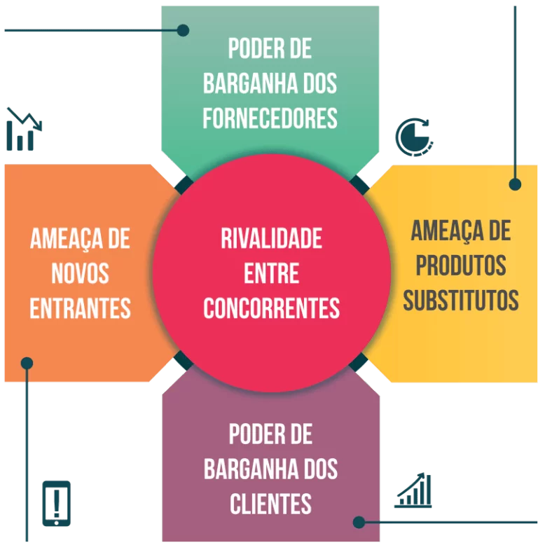

  <sup>Fonte: Imagem retirada do site https://ufabcjr.com.br/</sup>

</div>

**Rivalidade entre concorrentes existentes**

&emsp;A Universidad EAFIT atua no setor de ensino superior colombiano, especialmente no segmento privado, caracterizado por um número moderado de instituições de grande porte e forte reputação acadêmica. Seus principais concorrentes diretos incluem a Universidad de los Andes, líder no ranking nacional, a Universidad Pontificia Bolivariana (UPB) e a Universidad CES, todas com forte presença em áreas estratégicas de ensino e pesquisa. Essa rivalidade é intensificada por fatores como reputação acadêmica, qualidade do corpo docente, internacionalização, infraestrutura e inovação pedagógica. Apesar disso, a EAFIT diferencia-se por seu posicionamento como a principal universidade privada fora de Bogotá, pela diversificação de receitas e pela oferta de programas inovadores em múltiplas áreas do conhecimento, o que fortalece sua marca e a mantém competitiva no cenário nacional e regional.

**Poder de barganha de fornecedores**

&emsp;No setor educacional, os fornecedores podem incluir desde editoras acadêmicas e plataformas tecnológicas até prestadores de serviços de manutenção, segurança e alimentação. A EAFIT, por ser uma instituição de grande porte e com sólida situação financeira, tem poder de negociação elevado, podendo diversificar fornecedores e adotar soluções internas para reduzir dependências estratégicas. Sua posição consolidada no mercado permite estabelecer contratos de longo prazo em condições favoráveis, além de buscar parcerias acadêmicas e tecnológicas que geram benefícios mútuos, diminuindo o risco de impactos significativos advindos de aumento de custos ou mudanças nas condições de fornecimento.

**Poder de barganha de compradores**

&emsp;Os "compradores" no contexto da EAFIT são os estudantes e suas famílias, que avaliam não apenas o preço das mensalidades, mas também a qualidade do ensino, a empregabilidade dos egressos, as oportunidades de intercâmbio e o reconhecimento acadêmico. No segmento premium da educação superior privada, o poder de barganha é moderado: embora os alunos possam optar por outras instituições de prestígio, a reputação, a localização estratégica e o portfólio diversificado da EAFIT reduzem a elasticidade da demanda. No entanto, com o aumento da oferta de cursos online, híbridos e microcredentials — muitas vezes a preços menores —, cresce a pressão para que a EAFIT mantenha diferenciais claros de valor agregado, reforçando a importância de inovação contínua e experiência acadêmica de excelência.

**Ameaça de novos entrantes**

&emsp;O ingresso de novos competidores relevantes no ensino superior colombiano é dificultado por barreiras como altos investimentos em infraestrutura, acreditações, corpo docente qualificado e reputação acadêmica, além de regulamentações rigorosas. Apesar disso, o avanço da educação online e de plataformas globais de cursos representa uma ameaça indireta, pois reduz as barreiras geográficas e oferece alternativas de formação a custos competitivos. Nesse cenário, a EAFIT mitiga o risco por meio de expansão de programas digitais, parcerias internacionais e fortalecimento de sua marca como centro de excelência acadêmica e inovação.

**Ameaça de produtos substitutos**

&emsp;As principais alternativas ao ensino superior tradicional incluem cursos técnicos, bootcamps, programas de microcredentials e plataformas de aprendizado online, que oferecem formação mais rápida e focada em habilidades específicas. Esses formatos, muitas vezes mais acessíveis, podem atrair estudantes que buscam inserção rápida no mercado de trabalho ou atualização profissional contínua. A ameaça é crescente, especialmente em áreas ligadas à tecnologia e negócios, onde a aprendizagem prática é valorizada. No entanto, a EAFIT mantém vantagem competitiva ao oferecer uma formação integral, com reconhecimento acadêmico formal, rede de contatos e experiências de pesquisa e intercâmbio, fatores que ainda representam barreiras significativas para a substituição total por formatos alternativos.

#### 4.1.2. Análise SWOT

&emsp; Segundo Rother e Shook (2003), a Análise SWOT é uma ferramenta de planejamento estratégico que organiza visualmente as forças, fraquezas, oportunidades e ameaças de um negócio. Seu objetivo é auxiliar na avaliação do ambiente interno e externo de uma empresa ou projeto, e orientar uma tomada de decisão mais embasada na realidade.

&emsp; Dessa maneira, a aplicação dessa análise é crucial para o mapeamento estratégico da solução em desenvolvimento para a EAFIT. Fornecendo elementos vitais para a idealização e o debate de ideias do projeto, permitindo uma compreensão clara dos desafios e das oportunidades.

<div align="center">

   <sub>Figura 1 - Análise Swot </sub>

   

   <sup>Fonte: Material produzido pelos autores (2025)</sup>

</div>

&emsp; Na figura acima temos:

##### Forças:

- **Posicionada como uma das melhores universidades da Colômbia** - A Universidad EAFIT possui reconhecimento nacional por sua excelência acadêmica (UNIVERSIDAD EAFIT, 2025), foco na inovação e comprometimento com a formação integral de seus estudantes. É constantemente classificada entre as melhores instituições de ensino superior da Colômbia.

- **Credenciada como instituição de alta qualidade** - A EAFIT foi credenciada pelo Ministério Nacional da Educação da Colômbia como uma universidade de alta qualidade duas vezes seguidas, sendo a primeira universidade colombiana a ter esta recognição. Essa certificação garante que a instituição atende a rigorosos critérios de avaliação institucional, como infraestrutura, corpo docente, produção científica, governança e impacto social, contribuindo para a confiança do público interno e externo.

- **Currículo extenso e diverso, com opções de pós-graduação** - A universidade oferece uma ampla gama de programas acadêmicos em áreas como administração, economia, engenharia, humanidades, direito e ciências aplicadas. Além disso, conta com cerca de 90 opções de cursos de pós-graduação.

##### Fraquezas:

- **Gastos elevados com a manutenção do Campus Vivo** - Embora o Campus Vivo seja um diferencial arquitetônico e ambiental da EAFIT, sua manutenção representa custos operacionais significativos. Isso inclui jardinagem, segurança, manutenção predial e limpeza, o que pode impactar os recursos disponíveis para investimentos em outras áreas estratégicas, como digitalização ou internacionalização.

- **Inexistência de parcerias com universidades de referência na América Latina e no mundo** - Apesar de seu prestígio nacional, a EAFIT ainda apresenta limitações na construção de alianças acadêmicas internacionais robustas, especialmente com instituições de referência global. A ausência de programas de dupla titulação, intercâmbios amplamente reconhecidos e pesquisa conjunta com universidades de renome mundial limita o alcance internacional da instituição.

##### Ameaças:

- **Instabilidade econômica e política regional** - O contexto colombiano, assim como o de outras nações latino-americanas, é frequentemente marcado por flutuações econômicas, tensões sociais e mudanças políticas que podem afetar diretamente o financiamento da educação superior, os programas de intercâmbio, os investimentos em infraestrutura e a própria capacidade de planejamento estratégico das universidades privadas.

- **Competição com outras universidades sul-americanas** - A crescente profissionalização e internacionalização de outras universidades na América Latina, como a Universidad de Los Andes (Colômbia), Pontificia Universidad Católica (Chile), Universidade de São Paulo (Brasil) e Universidad Nacional Autónoma de México (México), impõe um desafio constante. A EAFIT precisa manter-se atualizada, inovadora e conectada globalmente para não perder sua atratividade frente à concorrência (QS, 2025).

##### Oportunidades:

- **Horizonte para a digitalização do atendimento ao aluno** - A universidade possui uma grande oportunidade de melhorar a experiência do estudante por meio da automação e digitalização de processos relacionados à vida acadêmica. Isso inclui sistemas mais inteligentes para acompanhamento de desempenho, integração com orientações pedagógicas, monitoramento psicológico, alertas de risco acadêmico, e acesso facilitado a recursos administrativos e financeiros. A adoção de plataformas tecnológicas modernas pode otimizar a gestão estudantil e fortalecer o engajamento institucional.

#### 4.1.3. Planejamento Geral da Solução
&emsp; Planejamento Geral da Solução é um conceito de organizar o projeto em tópicos com intuito de nunca se perder em relação a esses 6 tópicos: Dados que serão usados, neste caso, para abastecer o modelo preditivo, A solução proposta para ao cliente, tipo de tarefa, para que o produto será usado, benefícios ao escolher o produto e quais críterios e métricas será usada para acompanhar o sucesso da solução. Pode-se fazer uma analogia com um mapa, onde os tópicos citados são os locais para chegar ao produto ideal. A empresa PMBOK Guide, empresas de software e análise de projetos foram os primeiros a utilizar esse método de se guiar conforme o projeto está em andamento.

&emsp; O planejamento geral da solução é uma etapa fundamental em projetos de inteligência artificial e ciência de dados, já que é fácil se perder em um projeto que exige muitos detalhes. Nele são detalhados os dados disponíveis, os objetivos da solução, o tipo de tarefa de aprendizado de máquina mais adequada (como classificação ou regressão), além dos possíveis usos da ferramenta, benefícios esperados e critérios de sucesso do projeto feito.

&emsp; Primeiro, será mostrado a base que todo o projeto se baseará: Os dados. Fornecidos pela EAFIT, eles estão dispostos em tabelas de notas na nova matéria de programção de 775 alunos da instituição entre o primeiro e segundo semestre do ano de 2023. Logo abaixo, terá as explicações do que cada coluna significa:

- **Período:** Período letivo em que a aula é realizada.
- **Grupo:** Grupo ao qual o aluno pertence.
- **Horário:** Dia da semana e horário da aula do aluno.
- **Tipo de Documento:** Tipo de documento de identificação do aluno. Por exemplo: CC (maior de 17 anos), TI (menor de 18 anos).
- **Idade:** Determina se o aluno é adulto ou menor de idade (17 anos ou mais). Sexo: Sexo do aluno (masculino ou feminino).
- **Nome do Programa Acadêmico:** Nome do programa acadêmico que o aluno está cursando. STEM: Indica se o programa acadêmico está na área STEM (Sim/Não).
- **Semestre 1:** Nota obtida na primeira prova de meio de semestre.
- **Semestre 2:** Nota obtida na segunda prova de meio de semestre.
- **Parte 1 do Projeto:** Nota obtida no primeiro projeto.
- **Parte 2 do Projeto:** Nota obtida no segundo projeto.
- **Oficinas:** Nota média das oficinas.
- **Quizzes:** Nota final da prova.
- **Quiz 1 ao 8:** Notas dos quiz do 1 ao 8.
- **Tempo do Q1 ao Q8:** Tempo, em segundos, que o aluno demorou para fazer o Quiz referente.
- **CalcNotaQuiz:** Nota calculada do teste (média aritmética das notas do teste).
- **MelhoraNotaQuizes:** Indica se houve melhora nas notas do teste (VERDADEIRO/FALSO). As notas podem ser melhoradas completando atividades adicionais e respondendo a perguntas em sala de aula.
- **Quanto Melhora?:** Magnitude da melhora nas notas do teste (diferença entre Quices e CalcQuizNote).
- **Nota Final:** Nota final do curso.
- **Passou?:** Resultado final (Aprovado ou Reprovado no curso).


&emsp; Esse banco de dados fornecido será importante para que seja possível identificar padrões, nível de dificuldade entre as atividades entre outros dados importantes para o treinamento do modelo preditivo.

&emsp; Com o modelo preditivo, conseguimos resolver as dores do cliente, mas temos que contextualizar tal problema para ficar o mais claro possível nossos objetivos. A instituição EAFIT colocou uma nova matéria de programação em sua grade e, no primeiro ano, teve muitas notas baixas e vários alunos desistindo da matéria antes de acabar. Para solucionar esse problema, será produzido um modelo preditivo que ajudará os professores a administrar o curso, analisando as notas dos alunos e se há chance de reprovação dos mesmos. Com um sistema capaz de prever desempenhos e até prever se o aluno será reprovado ou não, os professores e coordenadores poderão disponibilizar o melhor suporte para os alunos que estão com dificuldade ou até grande risco de reprovação.


##### Tipo de Tarefa

&emsp; A solução engloba duas tarefas de aprendizado de máquina:

- **Classificação:** Utilizada para prever se o aluno será aprovado ou reprovado, categorizando os casos.

- **Regressão:** Aplicada para estimar as notas futuras com base em padrões de desempenho, frequência, participação e tempo de execução das provas.

&emsp; Mesmo com o modelo em mãos e o problema explicado detalhadamente, sem mostrar a utilidade não será muito produtivo.
&emsp; Com base em dados passados, como notas de quizzes e projetos de alunos de anos anteriores, o sistema preditivo irá ajudar os professores a identificar padrões de notas com o intuito de prever quais terão chances de reprovar a matéria. Assim, os educadores poderão intervir previamente, antes que os alunos atinjam a reprovação. A análise será entregue a partir da semana 5, depois terão atualizações dessa análise entre 3 e 4 semanas. Como sempre terá atualizações sobre as situações dos alunos, o projeto facilitará a tomada de decisões mais informadas e oportunas por parte dos professores, permitindo-lhes identificar com eficiência os alunos em risco de reprovação e oferecer-lhes apoio adicional. Além disso, com o acompanhamento e suporte à esses alunos, o desempenho geral dos alunos irá aumentar, terminando a matéria melhor qualificado e preparado para diversas ocasiões.

&emsp; Com todos os passos passados sendo feitos corretamentes, já é possível definir e observar como o modelo está performando. Primeiramente, a máquina, necessita acertar qual aluno está com dificuldade ou está caminhando para uma situação agravada de reprovação. Outro ponto que pode ser usado como métrica de sucesso é o aumento do suporte dos professores aos alunos e essa alta nos atendimentos resultar em melhoras nas notas. Além disso, o aumento da escolha, por parte dos alunos, de incluir essa matéria em sua grade curricular também é uma métrica de sucesso.

#### 4.1.4. Value Proposition Canvas
&emsp; O Canvas de Proposta de Valor é uma ferramenta visual que ajuda a alinhar, de forma prática e objetiva, o que uma solução oferece com o que o cliente realmente precisa. Desenvolvido por Alexander Osterwalder, Yves Pigneur e Alan Smith, ele organiza a análise em dois blocos complementares: o Perfil do Cliente, que detalha as tarefas atuais do cliente, as dores em relação aquela atividade e os ganhos esperados com a solução, e o Mapa de Valor, com as principais informações sobre o produto ou serviço, os elementos aliviantes de dores e as vantagens que criam de ganho. Nesse sentido, o objetivo é alcançar o "encaixe" entre oferta e demanda: entender claramente o que o cliente tenta realizar, quais obstáculos enfrenta e quais resultados espera, e então descrever como a solução elimina essas dores e potencializa os ganhos.

<div align="center">

   <sub>Figura : Canvas Proposta de Valor </sub>

   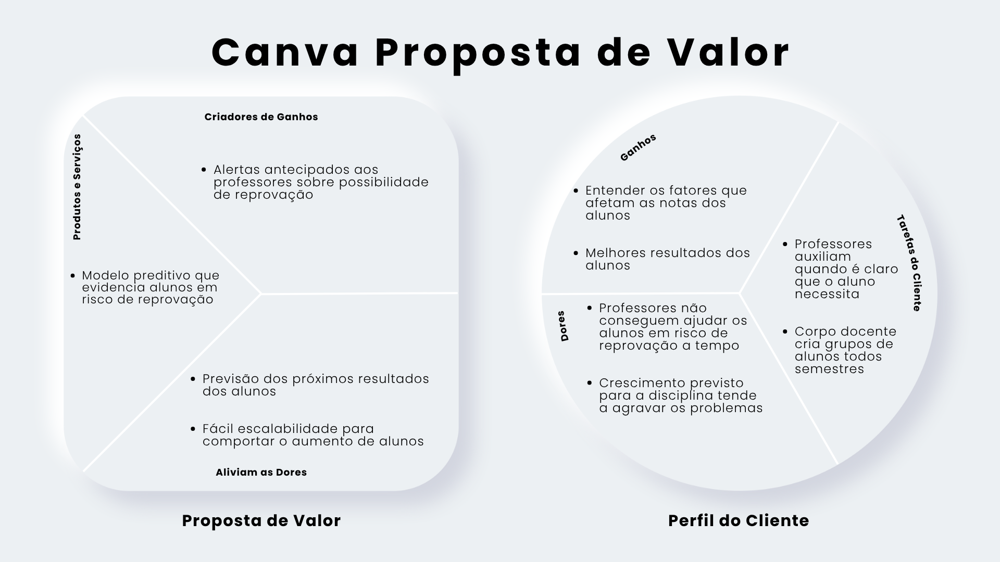

   <sup>Fonte: Material produzido pelos autores (2025)</sup>

</div>

##### Perfil do Cliente:
&nbsp;&nbsp;&nbsp;&nbsp;
&emsp; **Ganhos:** Professores e coordenação querem entender rapidamente o que impacta as notas para agir cedo e melhorar os resultados. Buscam visão por curso/área e horário, com evidências para orientar intervenções e monitores.

&nbsp;&nbsp;&nbsp;&nbsp;
&emsp; **Dores:** Alunos em risco são identificados tarde, por falta de previsibilidade e pela necessidade de juntar dados de várias fontes. O aumento de turmas piora a falta de visibilidade e dificulta priorizar quem atender.

&nbsp;&nbsp;&nbsp;&nbsp;
&emsp; **Tarefas do Cliente:** Professores intervêm quando o risco já está claro (após notas baixas) e organizam grupos a cada semestre. Precisam de um fluxo simples, online e padronizado para acompanhar evolução, comparar grupos e orientar monitores.

##### Proposta de Valor

&nbsp;&nbsp;&nbsp;&nbsp;
&emsp; **Criadores de Ganho:** Alertas antecipados nas primeiras semanas indicam probabilidade de reprovação por faixas de risco (baixo, médio, alto, muito alto). Um dashboard reúne evolução das notas, motivos do risco e filtros por programa, grupo e horário para ações rápidas e coordenadas.

&nbsp;&nbsp;&nbsp;&nbsp;
&emsp; **Aliviam as Dores:** O sistema prevê próximos resultados e explica o "porquê do risco" (ex.: quizzes pendentes, queda de desempenho, efeitos de horário/programa), reduzindo checagens manuais. É escalável, com execução automática por marcos do semestre ou upload manual, absorvendo o crescimento de alunos sem sobrecarga.

&nbsp;&nbsp;&nbsp;&nbsp;
&emsp; **Produtos e Serviços:** Modelo preditivo que destaca alunos em risco (nota final < 3) e diferencia "aprova", "reprova" e "cancela". Integra notas oficiais, quizzes/talleres, grupos/horários e indicadores de evolução, com privacidade garantida. Entrega inclui dashboard web, manuais (usuário e técnico), capacitação breve e revisão do modelo a cada semestre.

#### 4.1.5. Matriz de Riscos
&emsp; A análise de riscos e oportunidades em um projeto é uma etapa essencial no desenvolvimento de um modelo preditivo, pois permite mitigar possíveis problemas e, ao mesmo tempo, identificar oportunidades que possam alavancar a entrega do MVP. Segundo o PMBOK® Guide (PMI, 2021), o gerenciamento de riscos compreende os processos de planejamento, identificação, análise, resposta, monitoramento e controle de riscos e oportunidades que possam surgir ao longo do ciclo de vida do projeto. Com base nesse entendimento, propõe-se a seguinte divisão em matriz de riscos e matriz de oportunidades:


##### Riscos:

&emsp; Com base nas diretrizes apresentadas no PMBOK® Guide (PMI, 2021) e no conhecimento consolidado acerca da análise de riscos, elaborou-se a matriz de riscos do projeto com o objetivo de identificar, classificar e propor estratégias de mitigação para as ameaças potenciais ao desenvolvimento da solução. Essa abordagem permite antecipar problemas, minimizar impactos negativos e assegurar maior controle sobre as variáveis que podem comprometer o desempenho do modelo preditivo desenvolvido para a Universidade EAFIT, apresentado na figura xx.

<div align="center">

<sup>Figura xx: Matriz de riscos do projeto</sup>

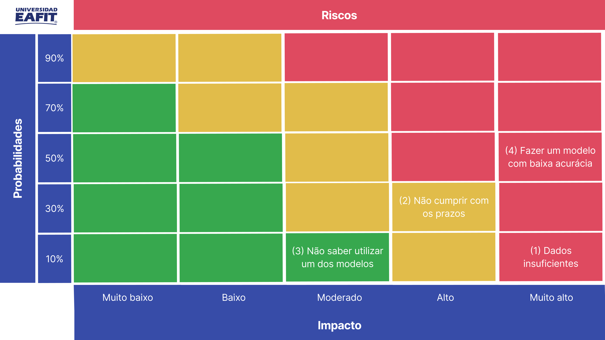

<sup>Fonte: Material produzido pelos autores</sup>

</div>

&emsp; A seguir, os riscos identificados são apresentados com base em cinco dimensões: categoria, ameaça, impacto, probabilidade e estratégia de mitigação. A classificação por categorias segue as diretrizes do PMBOK® Guide (PMI, 2021), visando facilitar o agrupamento, a análise e a priorização das ameaças ao longo do desenvolvimento do projeto. As categorias adotadas — Técnico, Humano, Organizacional e Acadêmico — refletem as diferentes naturezas dos riscos e permitem uma abordagem mais direcionada em sua gestão.

&emsp; O primeiro risco refere-se à possibilidade de treinar o modelo preditivo com uma quantidade insuficiente de dados, classificado como de natureza técnica. Trata-se de um risco de impacto muito alto, pois a escassez de dados inviabiliza o treinamento adequado do modelo e compromete todo o desenvolvimento do projeto. A probabilidade estimada é de 10%, uma vez que o parceiro institucional assumiu o compromisso de fornecer os dados necessários, reduzindo a chance de indisponibilidade. A estratégia de mitigação consiste em levantar previamente a quantidade mínima de dados amostrais e solicitar oficialmente à universidade a sua disponibilização.

&emsp; Outro risco identificado está relacionado ao descumprimento de prazos, classificado como humano. Essa ameaça envolve a possibilidade de membros do grupo não concluírem suas atividades no prazo definido, o que pode atrasar etapas subsequentes, gerar sobrecarga em alguns integrantes e comprometer a entrega de funcionalidades do MVP. O impacto é considerado alto e a probabilidade estimada em 30%, com base em experiências anteriores que indicam a necessidade de melhorar a definição de prazos e a comunicação. Para mitigar esse risco, recomenda-se reavaliar os prazos considerando o tempo de aprendizado e de testes, atualizar periodicamente o status das atividades e manter comunicação constante sobre eventuais impedimentos.

&emsp; Também foi identificada a dificuldade na aplicação de modelos preditivos, enquadrada na categoria acadêmica. Essa situação pode ocorrer quando houver obstáculos na implementação de um ou mais modelos apresentados durante as aulas. O impacto é moderado, pois, embora seja possível recorrer a modelos alternativos testados, há risco de que estes apresentem desempenho inferior ao originalmente planejado. A probabilidade de ocorrência é de 10%, considerando o suporte contínuo de professores e monitores. A mitigação envolve buscar auxílio técnico sempre que surgirem dificuldades, recorrendo à monitoria e ao corpo docente especializado.

&emsp; Por fim, considera-se o risco de desenvolver um modelo com baixa acurácia, classificado como técnico. Um desempenho insatisfatório compromete a utilidade prática da solução, podendo gerar diagnósticos incorretos sobre o risco de reprovação e afetar a credibilidade do projeto perante os stakeholders institucionais. Esse risco tem impacto alto e probabilidade estimada em 20%, já que, apesar dos esforços da equipe em testar diferentes algoritmos e estratégias de modelagem, podem ocorrer limitações nos dados ou ajustes inadequados. A mitigação proposta inclui a realização de experimentos com múltiplos algoritmos, aplicação de validação cruzada, otimização de hiperparâmetros e solicitação de feedback técnico a professores e monitores especializados.

##### Oportunidades:

&emsp; Além da identificação e análise dos riscos, é relevante reconhecer e explorar as oportunidades que o projeto oferece. A partir dessa perspectiva, elaborou-se a matriz de oportunidades com o propósito de potencializar fatores favoráveis, agregar valor ao desenvolvimento da solução e maximizar os benefícios dessa etapa de construção. Essa abordagem permite direcionar esforços para iniciativas que fortaleçam o trabalho do grupo e ampliem o impacto positivo do modelo preditivo desenvolvido para a Universidade EAFIT, apresentado na figura xx.

<div align="center">

<sup>Figura xx: Matriz de oportunidades do projeto</sup>

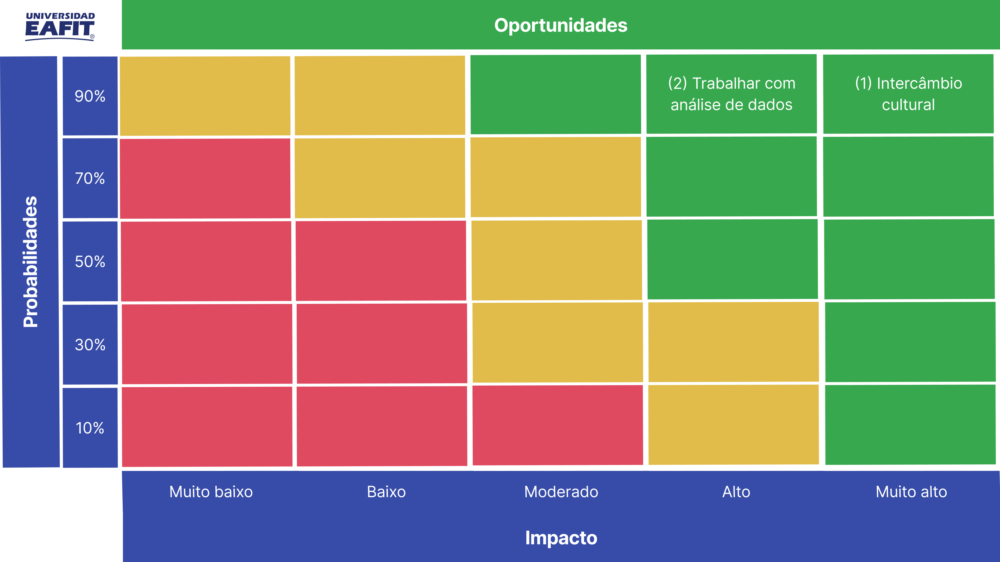

<sup>Fonte: Material produzido pelos autores</sup>

</div>

&emsp; As oportunidades identificadas no projeto foram descritas considerando três dimensões principais: oportunidade, impacto e probabilidade. Essa análise possibilita reconhecer e explorar fatores que podem agregar valor tanto ao desenvolvimento da solução quanto à formação acadêmica e profissional dos integrantes do grupo. A organização dessas informações de maneira clara contribui para embasar decisões estratégicas e maximizar os benefícios potenciais ao longo da execução do projeto.

&emsp; A primeira oportunidade está relacionada ao intercâmbio cultural, envolvendo a troca de experiências com a instituição parceira e o contato com metodologias de ensino aplicadas em outro país. Como nenhum dos integrantes do grupo teve, até então, a oportunidade de conhecer a Colômbia, esta experiência representa uma excelente chance de ampliar a compreensão sobre a realidade educacional e cultural local, enriquecendo não apenas o aprendizado acadêmico, mas também a vivência pessoal de cada participante. O impacto dessa oportunidade é considerado muito alto, e sua probabilidade de concretização chega a 90%, uma vez que o longo período de colaboração com a instituição colombiana torna praticamente certa a interação direta com seus profissionais e a troca de experiências que irão aprofundar o contexto da aplicação do modelo preditivo.

&emsp; A segunda oportunidade refere-se ao trabalho com análise de dados, no qual a equipe poderá aplicar técnicas para solucionar uma necessidade real de uma instituição de ensino de grande relevância na América Latina. Para muitos integrantes, essa será a primeira experiência prática na construção de um modelo preditivo, o que torna o projeto um recurso valioso para o desenvolvimento de competências técnicas e para o fortalecimento do portfólio profissional. O impacto é classificado como alto, e a probabilidade de concretização é de 90%, pois a equipe estará exposta a diferentes tipos de modelos preditivos e ambientes de execução, garantindo a todos a oportunidade de compreender os fundamentos da área e adquirir conhecimentos essenciais para futuros avanços na ciência de dados.

#### 4.1.6. Personas

&emsp; No desenvolvimento de produtos e serviços — especialmente em projetos de tecnologia e experiência do usuário — o uso de personas é uma prática amplamente adotada para orientar decisões de design. Uma persona é uma representação fictícia, porém plausível, de um usuário-alvo, construída a partir de dados qualitativos e quantitativos sobre seus comportamentos, necessidades, motivações e objetivos. Essa abordagem ajuda as equipes a manterem o foco nas expectativas reais do público, reduzindo suposições e alinhando o projeto às demandas concretas.
&emsp; De acordo com Cooper et al. (2014)[personas], personas funcionam como arquétipos que sintetizam as principais características de determinados segmentos de usuários, permitindo que designers e desenvolvedores fundamentem suas escolhas em evidências, e não em opiniões subjetivas. Ao serem aplicadas em documentos técnicos e estratégicos, elas contribuem para que o produto final seja relevante, funcional e verdadeiramente centrado no usuário.

<div align = "center">

<sub>Figura : Persona 1</sub>


<sup>Fonte: Material produzido pelos autores (2025)</sup>

</div>

##### Persona: Paola Andrea Vallejo Ramírez

**Perfil**

- Nome: Paola Andrea Vallejo Ramírez
- Gênero: Feminino
- Idade: 41 anos
- Cidade: Medellín - Antioquia, Colômbia
- Posição: Docente universitária e coordenadora de projetos pedagógicos na Universidad EAFIT

**Biografia**

&emsp; Paola nasceu em Medellín, na Colômbia, e cresceu em um ambiente onde a educação era altamente valorizada. Desde pequena, era curiosa e gostava de resolver problemas práticos. Apaixonada por aprender, escolheu seguir a carreira acadêmica e se formou em Engenharia de Software pela Universidade Industrial de Santander. Posteriormente, concluiu um mestrado em Educação e Tecnologias Digitais na Universidad de los Andes.

&emsp; Atualmente, mora em Medellín e leciona disciplinas introdutórias de programação na Universidad EAFIT, onde também lidera iniciativas de inovação educacional. É reconhecida por sua dedicação ao sucesso dos alunos e por seu compromisso com a inclusão e o uso ético da tecnologia na educação. Atua como ponte entre dados educacionais e ações pedagógicas eficazes, sempre buscando formas de aprimorar os resultados acadêmicos.

**Frustrações**

- Dificuldade em acompanhar o progresso individual de cada aluno devido ao grande número de estudantes e ao tempo limitado.
- Falta de ferramentas práticas para identificar alunos em risco antes que a situação se agrave.
- Sensação de que as ações pedagógicas são frequentemente reativas, e não preventivas.
- Necessidade constante de adaptar estratégias sem dados objetivos suficientes para orientar as decisões.

**Motivações**

- Acredita que a educação transforma vidas e que todos os alunos merecem oportunidades reais de sucesso.
- Busca aplicar métodos científicos e baseados em dados para tornar o ensino mais eficaz.
- Quer melhorar a retenção e o desempenho dos estudantes, especialmente os que enfrentam maiores dificuldades, reduzindo a taxa de evasão.
- Valoriza tecnologias que permitam aos professores agir com mais precisão e empatia.

 **Interesses**

- Ferramentas de visualização de dados e dashboards educacionais.
- Avaliação formativa e intervenções pedagógicas personalizadas.
- Inteligência artificial aplicada à educação.
- Equidade de gênero e inclusão no ensino superior.

<div align = "center">

<sub>Figura : Persona 2</sub>


<sup>Fonte: Material produzido pelos autores (2025)</sup>

</div>

##### Persona: Juan Esteban Gómez Ríos

**Perfil**

- Nome: Juan Esteban Gómez Ríos
- Gênero: Masculino
- Idade: 18 anos
- Cidade: Bello - Antioquia, Colômbia
- Posição: Estudante de primeiro semestre no curso de Engenharia de Sistemas da Universidad EAFIT

**Biografia**

&emsp; Juan nasceu e cresceu em Bello, uma cidade próxima a Medellín. Vem de uma família de classe média-baixa, onde é o primeiro a ingressar em uma universidade particular. Sempre se destacou na escola pública por sua criatividade e curiosidade, especialmente em áreas como matemática e informática, onde aprendeu programação básica por conta própria através de vídeos no YouTube.

&emsp; Ingressar na Universidad EAFIT foi um grande sonho realizado, mas o choque com a metodologia, o volume de conteúdo e a linguagem acadêmica mais formal têm representado grandes desafios. Juan trabalha meio período em uma loja para ajudar nas despesas e, por isso, nem sempre consegue dedicar o tempo ideal aos estudos. Mesmo esforçado, suas notas nos primeiros quizzes e avaliações foram baixas, o que começou a impactar sua motivação.

**Frustrações**

- Sente que estuda muito, mas não vê resultado nas notas.
- Tem dificuldades em organizar o tempo entre trabalho, estudo e tarefas da universidade.
- Acredita que falta suporte ou acompanhamento mais próximo dos professores para lidar com suas dificuldades.
- Não entende bem por que está indo mal: se é falta de base, cansaço ou desorganização.
- Tem receio de reprovar logo no primeiro semestre e decepcionar sua família.

**Motivações**

- Quer ser um exemplo positivo para seus irmãos mais novos e mostrar que é possível vencer pelos estudos.
- Sonha em trabalhar com tecnologia e desenvolvimento de software, talvez até criar sua própria startup.
- Gosta de aprender e se desenvolver, principalmente em temas práticos e aplicados.
- Quer provar para si mesmo que é capaz de se adaptar à universidade e ter sucesso.
- Valoriza professores que explicam com empatia e clareza, e se sente mais seguro quando percebe que está sendo acompanhado.

**Interesses**

- Desenvolvimento web e mobile.
- Jogos digitais e cultura geek.
- Comunidades de aprendizado online (como YouTube, Discord e fóruns de programação).
- Tecnologias acessíveis e que ajudam a estudar de forma independente.
- Bolsas de estudo e oportunidades extracurriculares que possam melhorar sua formação.

<div align = "center">

<sub>Figura : Persona 3</sub>


<sup>Fonte: Material produzido pelos autores (2025)</sup>

</div>

##### Persona: Ricardo Morales

**Perfil**

- Nome: Dr. Ricardo Morales
- Gênero: Masculino
- Idade: 55 anos
- Cidade: Medellín, Colômbia
- Posição: Diretor da Faculdade de Ciências e Engenharia na Universidad EAFIT

**Biografia**

&emsp; Ricardo nasceu em Bogotá e desde cedo demonstrou paixão por educação e tecnologia. Formou-se em Engenharia de Sistemas na Universidad Nacional da Colômbia e concluiu mestrado e doutorado em Inovação Educacional no MIT. Iniciou sua carreira como professor de algoritmos antes de assumir cargos de liderança acadêmica. Hoje, como diretor, busca integrar soluções baseadas em dados para melhorar o desempenho estudantil e reduzir a evasão.

**Frustrações**

- Possuímos dados históricos, mas não os aplicamos de forma preventiva.
- Intervimos apenas quando a reprovação já é inevitável.
- Parte do corpo docente ainda prioriza intuição em detrimento de evidências.

**Motivações**

- Transformar a EAFIT em referência em learning analytics na América Latina.
- Reduzir a taxa de reprovação em 25% nos próximos 3 anos.
- Criar um modelo replicável para outras disciplinas e instituições.

**Interesses**

- Educação.
- Estatística.

#### 4.1.7. Jornadas do Usuário

&nbsp; O mapeamento das jornadas dos usuários é fundamental para compreender como diferentes atores (professores, gestores e estudantes) interagem com o modelo preditivo e quais são as suas necessidades, emoções e oportunidades em cada etapa. Segundo Cooper et al. (2014), ao representar as experiências e necessidades do usuário em forma de jornada, é possível estruturar de maneira cronológica as atividades, emoções e pontos de contato, possibilitando um desenho de soluções mais eficaz e centrado no usuário. Detalhamos abaixo as jornadas de três personas centrais do projeto: **Paola Andrea Vallejo Ramírez (docente/coordenadora)**, **Dr. Ricardo Morales (diretor)** e **Juan Esteban Gómez Ríos (estudante)**.

---

##### Jornada da Persona 1: Paola Andrea Vallejo Ramírez (Docente/Coordenadora)

&emsp; **Cenário:** Utilização do modelo preditivo para identificar alunos em risco e planejar intervenções pedagógicas eficientes.

- **Atividades:** Analisa notas e frequência manualmente; identifica alunos com baixo desempenho; cria grupos de monitoria; oferece suporte individual ou em grupo; sugere atividades de reforço; acompanha evolução das notas.
- **Necessidades:** Ferramentas que automatizem a análise de dados; visão rápida de desempenho; informações claras sobre fatores de risco; priorização de alunos que precisam de mais ajuda; feedback sobre a eficácia das intervenções.
- **Emoções:** Frustração ao atuar de forma reativa; preocupação sobre eficácia das intervenções; esperança e alívio ao ver melhoras nas notas.
- **Oportunidades:** Alertas proativos sobre alunos em risco; insights sobre motivos do risco; classificação por faixas de risco; relatórios periódicos para medir impacto das ações pedagógicas.

<div align="center">
   <sub>Figura - Jornada da Persona Paola Andrea Vallejo Ramírez</sub>
   
   <sup>Fonte: Material produzido pelos autores (2025)</sup>
</div>

---

##### Jornada da Persona 2: Dr. Ricardo Morales (Diretor)

&emsp; **Cenário:** Avaliação estratégica e tomada de decisão sobre a continuidade e expansão do modelo preditivo.

- **Atividades:** Analisa relatórios de desempenho e evasão; define metas e KPIs; recebe relatórios periódicos; participa de reuniões com equipe pedagógica; decide sobre manutenção ou expansão do projeto; apresenta resultados para stakeholders.
- **Necessidades:** Dados claros sobre ROI; métricas de sucesso alinhadas a objetivos institucionais; evidências concretas de que a solução funciona; projeções de impacto da expansão.
- **Emoções:** Inquietação pela falta de dados preventivos; curiosidade e avaliação crítica diante dos relatórios; satisfação com resultados positivos e sensação de liderança.
- **Oportunidades:** Relatórios executivos sobre impacto da solução; dashboards consolidados comparando dados históricos; simulações de impacto em outras disciplinas; manuais de replicabilidade.

<div align="center">
   <sub>Figura - Jornada da Persona Dr. Ricardo Morales</sub>
   
   <sup>Fonte: Material produzido pelos autores (2025)</sup>
</div>

---

##### Jornada da Persona 3: Juan Esteban Gómez Ríos (Estudante)

&emsp; **Cenário:** Experiência como estudante em risco de reprovação e recebimento de suporte baseado no modelo preditivo.

- **Atividades:** Assiste às aulas; recebe notas baixas nos quizzes; sente esforço insuficiente; recebe suporte do professor; aplica orientações recebidas; dedica mais tempo aos estudos.
- **Necessidades:** Clareza sobre expectativas da disciplina; ajuda para entender notas baixas; suporte empático de professores; feedback personalizado; motivação e confiança.
- **Emoções:** Ansiedade e esperança no início; frustração e insegurança ao receber notas baixas; alívio e motivação ao receber suporte; orgulho e confiança ao ver progresso.
- **Oportunidades:** Sistema de boas-vindas com dicas personalizadas; notificações automáticas alertando risco; relatórios com insights para professores; gamificação com medidores de progresso.

<div align="center">
   <sub>Figura - Jornada da Persona Juan Esteban Gómez Ríos</sub>
   
   <sup>Fonte: Material produzido pelos autores (2025)</sup>
</div>

---

&nbsp;A análise conjunta das jornadas de **Paola Andrea Vallejo Ramírez (docente/coordenadora)**, **Dr. Ricardo Morales (diretor)** e **Juan Esteban Gómez Ríos (estudante)** evidencia como o modelo preditivo se conecta de maneira complementar aos diferentes níveis da comunidade acadêmica. Enquanto para o **estudante** o foco está em apoio personalizado, motivação e superação de dificuldades, para a **docente** a ênfase recai sobre ferramentas práticas de análise, priorização de alunos em risco e feedback sobre intervenções. Já o **gestor** necessita de dados consolidados, projeções estratégicas e métricas de impacto que sustentem decisões institucionais.

&nbsp;Assim, percebe-se que as jornadas, apesar de distintas, são interdependentes: a motivação e o progresso do aluno alimentam os indicadores analisados pela professora; esses dados, por sua vez, são consolidados em relatórios que oferecem ao diretor uma visão estratégica da efetividade da solução. Essa correlação cria um **ciclo virtuoso de informação**, no qual cada persona se beneficia de forma diferenciada, mas convergente, reforçando o alinhamento entre **ações pedagógicas, suporte individualizado e decisões estratégicas**.

&nbsp;Portanto, as jornadas não devem ser vistas isoladamente, mas como partes de um ecossistema de inovação educacional, no qual o modelo preditivo atua como elo central entre experiência do aluno, prática docente e gestão institucional.


#### 4.1.8 Política de Privacidade

##### **Modelo de Política de Privacidade:**

&emsp; A Política de Privacidade é um documento que tem como objetivo informar de forma clara e transparente como uma organização realiza a coleta, o uso, o armazenamento e a proteção dos dados pessoais de seus usuários. No Brasil, esse processo deve estar em conformidade com a Lei Geral de Proteção de Dados Pessoais (LGPD), em vigor desde 2020. A LGPD estabelece regras e princípios para o tratamento de dados, garantindo os direitos dos titulares e promovendo práticas seguras, éticas e responsáveis por parte das instituições.

##### **Projeto Latech**

- **Informações Gerais:** Esta política de privacidade informa como o projeto Latech, desenvolvido pelo grupo Throxy, trata os dados pessoais coletados durante o uso da solução. Está em conformidade com a Lei nº 13.709/2018 - LGPD.<br>

- **Dados Coletados**<br>
   1- *Dados fornecidos diretamente:* Gênero, Faixa etária e Programa Acadêmico.<br>
   2- *Dados coletados automaticamente:* Notas dos quizzes, provas e projetos realizados no curso<br>

- **Finalidade do Tratamento:** A finalidade do tratamento é analisar e encontrar alunos que estão com probabilidade de serem reprovados para que sejam introduzidos em um programa de ajuda com o objetivo de aumentar a taxa de aprovação dos alunos.<br>

- **Armazenamento e Retenção**<br>
   1- *Local:* Arquivo Excel<br>
   2- *Prazo:* 10 semanas<br>

- **Compartilhamento de Dados:** Parceiros técnicos, Fornecedores dos dados.<br>

- **Segurança dos Dados:** Todos os dados pessoais coletados são armazenados com técnicas de segurança da informação, incluindo criptografia em repouso (AES-256) e em trânsito (TLS), além de controles de acesso e autenticação. Quando armazenados localmente, os arquivos são protegidos por criptografia de disco e acesso restrito.<br>

- **Direitos dos Titulares:** Acesso, correção, exclusão, revogação de consentimento

- **Solicitações via e-mail:** lgonzalez8@eafit.edu.co

- **Encarregado de Dados (DPO):**<br>
   1- *Nome:* Paola Vallejo<br>
   2- *E-mail:* pvallej3@eafit.edu.co<br>

##### **Política de Privacidade na Colômbia**

&emsp; Na Colômbia, a Lei sobre proteção de dados é a Lei Estatutária 1581 de 2012. Sancionada em 2017, ela visa garantir o direito constitucional à retificação e atualização de dados que cosntem em vases de dados ou arquivos, conforme os artigos 15(direito ao habeas data) e 20(direito à informação) da Constituição Política colombiana. Entrou em vigor em 27 de junho de 2013, por meio do Decreto 1377 de 2013

### 4.2. Compreensão dos Dados
&emsp; Esta seção tem como objetivo compreender todo o processo de entendimento dos dados do projeto. Esse processo representa o primeiro contato dos integrantes do grupo com os dados fornecidos pela empresa parceira. Trata-se de um momento destinado a analisar a estrutura e a composição desses dados, por meio de consultas, aplicação de métodos de estatística descritiva, identificação de colunas numéricas e categóricas, além da realização de etapas de pré-processamento, normalização e limpeza dos dados disponibilizados.

#### 4.2.1. Exploração de dados
Esta etapa inicial marca o primeiro contato com os dados, sendo responsável pela análise preliminar e pela identificação dos tipos de variáveis que compõem a base. A partir dessa exploração, torna-se possível compreender melhor a natureza das informações disponíveis e orientar as próximas etapas de preparação e tratamento.
  A base de dados contém informações de alunos matriculados em um curso de Pensamento Computacional da Universidade EAFIT e apresenta as seguintes features:

<div align = "center">

<sub>Tabela : Classificações das variáveis</sub>

<table align="center">

| Variável | Descrição | Tipo de Variável |
|:-----:|:-----:|:-----:|
| **Período** | Indica o turno do curso (manhã/tarde/noite). | Categórica |
| **Grupo** | Identificação da turma ou grupo de alunos. | Categórica |
| **Horário** | Hora da aula (valor inteiro). | Numérica discreta |
| **Tipo\_Documento** | Tipo de documento de identificação do aluno. | Categórica |
| **Idade** | Idade do aluno em anos | Numérica discreta |
| **Gênero** | Sexo/gênero do aluno. | Categórica |
| **Nome\_Programa\_Acadêmico** | Nome do programa/curso acadêmico do aluno. | Categórica |
| **STEM** | Indica se o curso é da área STEM (Sim/Não). | Categórica binária |
| **Parcial\_1** | Nota do aluno na primeira avaliação parcial. | Numérica contínua |
| **Parcial\_2** | Nota do aluno na segunda avaliação parcial. | Numérica contínua |
| **Projeto\_Parte1** | Nota do primeiro projeto. | Numérica contínua |
| **Projeto\_Parte2** | Nota do segundo projeto. | Numérica contínua |
| **Taller** | Nota obtida em atividades práticas. | Numérica contínua |
| **Quizzes** | Nota agregada dos quizzes. | Numérica contínua |
| **Fecha\_Quiz1** | Data de realização do Quiz 1\. | Temporal (Data) |
| **Quiz1** | Nota obtida no Quiz 1\. | Numérica contínua |
| **TempoQ1** | Tempo gasto no Quiz 1 (em minutos/segundos). | Numérica contínua |
| **Fecha\_Quiz2** | Data de realização do Quiz 2\. | Temporal (Data) |
| **Quiz2** | Nota obtida no Quiz 2\. | Numérica contínua |
| **TempoQ2** | Tempo gasto no Quiz 2\. | Numérica contínua |
| **Fecha\_Quiz3** | Data de realização do Quiz 3\. | Temporal (Data) |
| **Quiz3** | Nota obtida no Quiz 3\. | Numérica contínua |
| **TempoQ3** | Tempo gasto no Quiz 3\. | Numérica contínua |
| **Fecha\_Quiz4** | Data de realização do Quiz 4\. | Temporal (Data) |
| **Quiz4** | Nota obtida no Quiz 4\. | Numérica contínua |
| **TempoQ4** | Tempo gasto no Quiz 4\. | Numérica contínua |
| **Fecha\_Quiz5** | Data de realização do Quiz 5\. | Temporal (Data) |
| **Quiz5** | Nota obtida no Quiz 5\. | Numérica contínua |
| **TempoQ5** | Tempo gasto no Quiz 5\. | Numérica contínua |
| **Fecha\_Quiz6** | Data de realização do Quiz 6\. | Temporal (Data) |
| **Quiz6** | Nota obtida no Quiz 6\. | Numérica contínua |
| **TempoQ6** | Tempo gasto no Quiz 6\. | Numérica contínua |
| **Fecha\_Quiz7** | Data de realização do Quiz 7\. | Temporal (Data) |
| **Quiz7** | Nota obtida no Quiz 7\. | Numérica contínua |
| **TempoQ7** | Tempo gasto no Quiz 7\. | Numérica contínua |
| **Quiz8** | Nota obtida no Quiz 8\. | Numérica contínua |
| **CalcNotaQuiz** | Cálculo agregado da nota de quizzes. | Numérica contínua |
| **MelhoraNotaQuizzes** | Indicador se houve melhora nos quizzes. | Categórica binária |
| **Quanto melhora?** | Valor quantitativo da melhora nas notas. | Numérica contínua |
| **Qualificação\_Oficial** | Nota oficial final do curso. | Numérica contínua |
| **Aprovo** | Indica se o aluno foi aprovado (Sim/Não). | Categórica binária |

</table>

<sup>Fonte: Material produzido pelos autores (2025)</sup>

</div>

#### 4.2.2. Pré-processamento

&emsp; Antes da etapa de modelagem, é essencial realizar um rigoroso pré-processamento dos dados. Segundo Silva, Peres e Boscarioli (2016), esta fase é fundamental para garantir a integridade e a qualidade do dataset, mitigando o risco de conclusões preciptadas ou de baixa performance do modelo. O objetivo deste processo é transformar os dados brutos — marcados por inconsistências, erros de formatação e ruídos — em um conjunto de dados limpo, padronizado e estruturado, prontos para serem aplicados no treinamento do modelo.

&emsp; Para alcançar tal objetivo, foi desenvolvido um conjunto de funções utilitárias, organizadas em um pipeline sequencial. As seções a seguir detalham cada uma dessas funções e a lógica de sua execução:

##### 4.2.2.1. Funções Utilitárias

&emsp; A seguir, são apresentadas as funções desenvolvidas para a limpeza, padronização e tratamento do dataset.

- **Detecção e Padronização de Erros**

&emsp; A análise exploratória inicial identificou a presença de múltiplos tokens de erro provenientes do google planilhas que atrapalham a análise dos dados. A função replace_excel_errors foi criada para resolver este problema, substituindo todas as ocorrências desses tokens pelo valor nulo do NumPy, o numpy.nan:

```python

def replace_excel_errors(df, cols=None):
    df = df.copy()
    if cols is None:
        cols = df.select_dtypes(include="object").columns.tolist()
    for c in cols:
        if c in df.columns:
            df[c] = df[c].replace(list(ERROR_TOKENS), np.nan)
    return df

```

- **Tradução e Padronização de Conteúdo**

&emsp; Para melhorar a interpretação dos dados durante o processo de desenvolvimento do modelo, foi necessário traduzir os nomes das colunas e padronizar os valores categóricos. A função padroniza_df centraliza essas operações. Além de renomear as colunas para o português (conforme rename_map), a função aplica mapeamentos específicos para corrigir os dados com diversas variantes em colunas críticas como Aprovou, Genero e STEM, que continha múltiplas representações para a mesma informação booleana. Essa padronização é vital para a construção do modelo e treinamento dele. Todo esse processo ocorreu da seguinte maneira:


```python

def padroniza_df(df):
    df = df.copy().rename(columns=rename_map)
    df = replace_excel_errors(df)
    if "Nome_Programa_Academico" in df.columns:
        df["Nome_Programa_Academico"] = (
            df["Nome_Programa_Academico"].astype(str).str.strip().replace(MAPA_PROGRAMAS, regex=False)
        )
    if "Aprovou" in df.columns:
        df["Aprovou"] = df["Aprovou"].astype(str).str.strip().replace(MAPA_APROV, regex=False)
    if "Idade" in df.columns:
        df["Idade"] = df["Idade"].astype(str).str.strip().replace(MAPA_IDADE, regex=False)
    if "Genero" in df.columns:
        df["Genero"] = df["Genero"].astype(str).str.strip().replace(MAPA_GENERO, regex=False)
    if "STEM" in df.columns:
        mask = df["STEM"].notna()
        if mask.any():
            df.loc[mask, "STEM"] = df.loc[mask, "STEM"].astype(str).str.strip().replace(MAPA_STEM, regex=False)
    return df

```

- **Normalização de Variáveis Temporais**

&emsp; As colunas que registram o tempo de execução dos quizzes (TempoQ) foram disponibilizado com unidades de tempo e outros caracteres que não são interpretados corretamente pelo modelo, para isso foi desenvolvida a função parse_to_seconds. Utilizando expressões regulares e lógica condicional, função transforma esses dados irregulares na quantidade de segundos correspondente. A função converte_colunas_tempo aplica essa transformação a todas as colunas de tempo relevantes, da seguinte maneira:

```python

_PATTERN_TEMPO = re.compile(
    r"^\s*(?:(\d+)\s*minuto(?:s)?)?\s*(?:(\d+)\s*segundo(?:s)?)?\s*$",
    re.IGNORECASE
)

def parse_to_seconds(val):
    if pd.isna(val):
        return np.nan
    if isinstance(val, (int, float)) and not isinstance(val, bool):
        try:
            return int(val)
        except Exception:
            return np.nan
    if isinstance(val, str):
        s = val.strip()
        try:
            return int(float(s))
        except Exception:
            pass
        s_norm = s.replace(" e ", " ").replace(",", " ")
        m = _PATTERN_TEMPO.match(s_norm)
        if m:
            mins, secs = m.group(1), m.group(2)
            total = (int(mins) * 60 if mins else 0) + (int(secs) if secs else 0)
            return total if (mins or secs) else np.nan
        if ":" in s_norm:
            parts = [p.strip() for p in s_norm.split(":")]
            if len(parts) == 2 and all(p.isdigit() for p in parts):
                mm, ss = map(int, parts)
                return mm * 60 + ss
            if len(parts) == 3 and all(p.isdigit() for p in parts):
                hh, mm, ss = map(int, parts)
                return hh * 3600 + mm * 60 + ss
    return np.nan

def converte_colunas_tempo(df):
    df = df.copy()
    cols_tempo = [c for c in df.columns if re.match(r"^(TempoQ|TiempoQ)\d+$", c)]
    for col in cols_tempo:
        df[col] = df[col].apply(parse_to_seconds)
    return df

```

- **Filtragem de Dados de Alunos Ausentes**

&emsp; Para o objetivo do modelo, os alunos faltantes atrapalham na predição do modelo. A função filtra_alunos_presentes implementa essa regra de negócio. Ela identifica os alunos para os quais todas as colunas de data de  entrega de quizzes são nulas e remove esses registros do dataset. A ausência total de datas de entrega indica que o aluno faltou durante a aplicação das atividades avaliativas. Após a filtragem, as próprias colunas de data são removidas, da seguinte forma:

```python

# Remove os alunos faltantes
def filtra_alunos_presentes(df):
    df = df.copy()
    cols_data = [c for c in df.columns if re.match(r"^(Data_Quiz|Fecha_Quiz)\d+$", c)]
    if not cols_data:
        return df
    df_filtrado = df.dropna(subset=cols_data, how="all")
    df_filtrado = df_filtrado.drop(columns=cols_data)
    return df_filtrado

```

- **Identificação e Tratamento de Outliers**

&emsp; A presença de outliers em variáveis numéricas pode impactar negativamente o desempenho do modelo preditivo. A função remove_outliers foi projetada para identificar e mitigar esses valores extremos. A identificação é feita pelo método de Tukey, que utiliza o Intervalo Interquartil (IQR) para definir limites estatísticos. Para o tratamento, optou-se pela técnica de clipping, que substitui os outliers pelo valor do limite mais próximo (inferior ou superior). Essa abordagem tem a vantagem de reduzir a influência dos valores extremos sem descartar o registro inteiro, preservando as informações contidas nas outras features daquela observação. A função também gera visualizações de boxplots antes e depois do tratamento, permitindo uma validação visual da eficácia do processo.

```python

def remove_outliers(df, n_cols_per_row=3):
    df_numeric = df.select_dtypes(include=["number"])
    df_numeric = df_numeric.drop(columns=["Grupo"], errors="ignore")  # evita erro se não existir

    n_cols = len(df_numeric.columns)
    n_rows = math.ceil(n_cols / n_cols_per_row)

    # Boxplots originais
    fig, axes = plt.subplots(n_rows, n_cols_per_row, figsize=(6*n_cols_per_row, 4*n_rows))
    axes = axes.flatten()
    for i, col in enumerate(df_numeric.columns):
        sns.boxplot(x=df_numeric[col], ax=axes[i])
        axes[i].set_title(f"Boxplot - {col}")
    # remover eixos vazios
    for j in range(i+1, len(axes)):
        fig.delaxes(axes[j])
    plt.tight_layout()
    plt.show()

    # Normalizar os outliers (clip)
    for col in df_numeric.columns:
        Q1 = df_numeric[col].quantile(0.25)
        Q3 = df_numeric[col].quantile(0.75)
        IQR = Q3 - Q1
        lower = Q1 - 1.5 * IQR
        upper = Q3 + 1.5 * IQR
        df_numeric[col] = df_numeric[col].clip(lower, upper)

    # Boxplots limpos
    fig, axes = plt.subplots(n_rows, n_cols_per_row, figsize=(6*n_cols_per_row, 4*n_rows))
    axes = axes.flatten()
    for i, col in enumerate(df_numeric.columns):
        sns.boxplot(x=df_numeric[col], ax=axes[i])
        axes[i].set_title(f"Boxplot cleaned - {col}")
    for j in range(i+1, len(axes)):
        fig.delaxes(axes[j])
    plt.tight_layout()
    plt.show()

    return df_numeric

```

- **Codificação de Variáveis Categóricas**

&emsp; Como etapa final, as variáveis categóricas restantes foram transformadas em um formato numérico que pode ser processado pelo modelo, utilizando a técnica de One-Hot Encoding. A implementação foi segregada em duas funções (fit_onehot_encoder e aplica_onehot). O encoder é "treinado" (fit) apenas uma vez no conjunto de dados principal. A transformação (aplica) pode então ser consistentemente aplicada a qualquer novo conjunto de dados (como dados de teste ou validação). A implementação também trata explicitamente valores ausentes, criando uma categoria "MISSING", o que permite ao modelo aprender padrões a partir da própria ausência de dados.

```python

def fit_onehot_encoder(df_cat, cat_cols):
    cat_cols_exist = [c for c in cat_cols if c in df_cat.columns]
    if not cat_cols_exist:
        return {"type": "none", "encoder": None, "columns": [], "cat_cols": []}
    X_fit = replace_excel_errors(df_cat[cat_cols_exist].copy(), cols=cat_cols_exist)
    X_fit = X_fit.fillna("MISSING").astype(str)
    try:
        from sklearn.preprocessing import OneHotEncoder
        try:
            enc = OneHotEncoder(sparse_output=False, handle_unknown="ignore")
        except TypeError:
            enc = OneHotEncoder(sparse=False, handle_unknown="ignore")
        enc.fit(X_fit)
        cols = list(enc.get_feature_names_out(cat_cols_exist))
        return {"type": "sklearn", "encoder": enc, "columns": cols, "cat_cols": cat_cols_exist}
    except Exception:
        dummies = pd.get_dummies(X_fit, prefix=cat_cols_exist, dummy_na=False)
        cols = dummies.columns.tolist()
        return {"type": "pandas", "encoder": cols, "columns": cols, "cat_cols": cat_cols_exist}

def aplica_onehot(df, encoder_info):
    df = df.copy()
    if encoder_info["type"] == "none":
        return df
    cat_cols_exist = encoder_info["cat_cols"]
    X = replace_excel_errors(df[cat_cols_exist].copy(), cols=cat_cols_exist).fillna("MISSING").astype(str)
    if encoder_info["type"] == "sklearn":
        arr = encoder_info["encoder"].transform(X)
        encoded_df = pd.DataFrame(arr, columns=encoder_info["columns"], index=df.index)
        out = pd.concat([df.drop(columns=cat_cols_exist), encoded_df], axis=1)
    else:
        dummies_df = pd.get_dummies(X, prefix=cat_cols_exist, dummy_na=False)
        all_cols = encoder_info["columns"]
        for c in all_cols:
            if c not in dummies_df.columns:
                dummies_df[c] = 0
        dummies_df = dummies_df[all_cols]
        out = pd.concat([df.drop(columns=cat_cols_exist), dummies_df], axis=1)
    bad_cols = [c for c in out.columns if "#ERROR!" in c]
    if bad_cols:
        out = out.drop(columns=bad_cols)
    return out

```

##### 4.2.2.2. Pipeline de Execução do Pré-processamento
 
&emsp; As funções utilitárias foram integradas em um pipeline sequencial para processar os dados brutos. O processo inicia-se com o carregamento dos datasets. Em seguida, a função padroniza_df é aplicada para realizar a tradução, padronização e limpeza inicial. As colunas de tempo são normalizadas para segundos. Após isso, os alunos ausentes são filtrados com base na ausência de entregas. Após a concatenação dos datasets, a função remove_outliers trata os valores extremos nas features numéricas. Por fim, as variáveis categóricas são transformadas via One-Hot Encoding, resultando no dataframe final, pronto para a modelagem.

```python

# 1) Carregar Excel
df1_raw = pd.read_excel(XLSX1_PATH, sheet_name=SHEET_INDEX)
df2_raw = pd.read_excel(XLSX2_PATH, sheet_name=SHEET_INDEX)

# 2) Padronizar valores/nomes
df1 = padroniza_df(df1_raw)
df2 = padroniza_df(df2_raw)

# 3) Converter tempos para segundos
df1 = converte_colunas_tempo(df1)
df2 = converte_colunas_tempo(df2)

# 4) Filtrar apenas alunos com algum quiz e remover colunas de datas
df1_presentes = filtra_alunos_presentes(df1)
df2_presentes = filtra_alunos_presentes(df2)

# 5) Concatenar
df_consolidado = pd.concat([df1_presentes, df2_presentes], ignore_index=True)

# 5.1) Limpar outliers das colunas numéricas
df_numeric_clean = remove_outliers(df_consolidado)  # faz clip nos outliers
# Substituir as colunas numéricas no df_consolidado
df_consolidado[df_numeric_clean.columns] = df_numeric_clean

# 6) Remover linhas com STEM ausente, replicando lógica original
if "STEM" in df_consolidado.columns:
    df_consolidado = df_consolidado.dropna(subset=["STEM"])

# 7) One-Hot
cat_cols = ["Tipo_Documento", "Idade", "Genero", "STEM", "MelhoraNotaQuizzes", "Aprovou"]
encoder_info = fit_onehot_encoder(df_consolidado, cat_cols)
df_onehot = aplica_onehot(df_consolidado, encoder_info)

```

&emsp; Ao final deste pipeline, o dataframe está devidamente processado e preparado para a próxima fase do projeto, a análise de hipóteses formulada conforme descrito na seção 4.2.3.

#### 4.2.3. Hipóteses

&emsp; A etapa de verificação de hipóteses é um pilar no processo de mineração de dados. Conforme destacam Silva, Peres e Boscarioli (2016), a qualidade do resultado da modelagem está diretamente ligada à compreensão das características e da distribuição dos dados de entrada. Nesse contexto, a construção de um modelo preditivo robusto exige que os pressupostos dos algoritmos sejam validados. Muitos modelos, especialmente os paramétricos como a regressão linear, partem da suposição de que as variáveis seguem uma distribuição normal, e ignorar essa premissa pode levar a inferências incorretas e a decisões de negócio equivocadas.

&emsp; A hipótese central investigada nesta análise é se as principais variáveis quantitativas do projeto seguem uma distribuição normal. Esta verificação é crucial, pois o resultado orienta diretamente as etapas seguintes do projeto, incluindo:

1.  A escolha entre testes estatísticos **paramétricos** (que assumem normalidade) e **não-paramétricos** (que não possuem tal premissa).
2.  A necessidade de aplicar **técnicas de transformação** de dados para normalizar variáveis assimétricas.
3.  A seleção de **métodos de escalonamento** e tratamento de *outliers*, visto que modelos baseados em distância (como SVM e K-Means) são sensíveis à escala e à distribuição dos dados.

&emsp; A seguir, detalhamos o teste dessa hipótese para as três variáveis selecionadas.

##### 4.2.3.1. Teste de Normalidade para a variável `CalcNotaQuiz`

* **Hipótese:** A variável `CalcNotaQuiz`, que representa o número de itens adquiridos em cada transação, segue uma distribuição normal. A suposição inicial seria que a maioria das transações se concentraria em torno de uma média, com menos transações contendo muito poucos ou muitos itens.
* **Implementação e Análise:** Para validar essa hipótese, foi aplicado o teste de aderência de Shapiro-Wilk, um método estatístico robusto para verificação de normalidade. No notebook do projeto, o teste foi executado utilizando a biblioteca `scipy.stats`, conforme o código apresentado. O resultado obtido foi um **p-valor de 5.73e-27**.

    ```python
        # Testando normalidade para "CalcNotaQuiz" via Shapiro-Wilk
        from scipy.stats import shapiro

        dados = df_consolidado['CalcNotaQuiz'].dropna()
        stat, p = shapiro(dados)

        print('H0: Os dados seguem uma distribuição normal')
        print('H1: Os dados não seguem uma distribuição normal')
        print("Estatística W:", stat)
        print("p-valor:", p)

        if p > 0.05:
            print("Não rejeitamos H0: os dados seguem uma distribuição normal.")
        else:
            print("Rejeitamos H0: os dados não seguem uma distribuição normal.")

        # Saída:
        # H0: Os dados seguem uma distribuição normal
        # H1: Os dados não seguem uma distribuição normal
        # Estatística W: 0.9158549463812558
        # p-valor: 5.737420736467878e-27
        # Rejeitamos H0: os dados não seguem uma distribuição normal.
    ```

* **Conclusão:** Como o p-valor é significativamente menor que o nível de significância padrão de 0,05, a hipótese nula de normalidade (H₀) é **rejeitada**. Isso indica que há evidência estatística forte para afirmar que os dados de `CalcNotaQuiz` não seguem uma distribuição normal.

##### 4.2.3.2. Teste de Normalidade para a variável `Talleres`

* **Hipótese:** A variável `Talleres`, referente à nota de trabalhos complementares, segue uma distribuição normal. A expectativa seria que as notas se distribuíssem simetricamente em torno de uma média central.
* **Implementação e Análise:** Assim como na variável anterior, o código no notebook aplicou o teste de Shapiro-Wilk sobre os dados da variável `Talleres` (referenciada como `Oficinas` no código). O teste gerou um **p-valor de 3.38e-39**.

    ```python
        # Testando normalidade para "Oficinas" (Talleres) via Shapiro-Wilk
        from scipy.stats import shapiro

        dados = df_consolidado['Oficinas'].dropna()
        stat, p = shapiro(dados)

        print('H0: Os dados seguem uma distribuição normal')
        print('H1: Os dados não seguem uma distribuição normal')
        print("Estatística W:", stat)
        print("p-valor:", p)

        if p > 0.05:
            print("Não rejeitamos H0: os dados seguem uma distribuição normal.")
        else:
            print("Rejeitamos H0: os dados não seguem uma distribuição normal.")

        # Saída:
        # H0: Os dados seguem uma distribuição normal
        # H1: Os dados não seguem uma distribuição normal
        # Estatística W: 0.7847014498757214
        # p-valor: 3.386401173855684e-39
        # Rejeitamos H0: os dados não seguem uma distribuição normal.
    ```

* **Conclusão:** O p-valor extremamente baixo leva à **rejeição** da hipótese nula (H₀). Fica evidente que a distribuição das notas de `Talleres` também desvia significativamente da normalidade.

#### 4.2.3.3. Teste de Normalidade para a variável `Calificación_Oficial`

* **Hipótese:** A variável `Nota_Oficial`, que representa o custo de produção dos produtos, segue uma distribuição normal. A premissa seria que a maioria dos produtos teria um custo próximo da média, com menos produtos sendo extremamente baratos ou caros para produzir.
* **Implementação e Análise:** O mesmo procedimento foi repetido para a variável `Nota_Oficial`. A execução do código de teste de Shapiro-Wilk, conforme documentado no notebook, também resultou em um p-valor muito baixo (inferior a 0,05).

    ```python
        # Testando normalidade para "Nota_Oficial" (Calificación_Oficial) via Shapiro-Wilk
        from scipy.stats import shapiro

        dados = df_consolidado['Nota_Oficial'].dropna()
        stat, p = shapiro(dados)

        print('H0: Os dados seguem uma distribuição normal')
        print('H1: Os dados não seguem uma distribuição normal')
        print("Estatística W:", stat)
        print("p-valor:", p)

        if p > 0.05:
            print("Não rejeitamos H0: os dados seguem uma distribuição normal.")
        else:
            print("Rejeitamos H0: os dados não seguem uma distribuição normal.")
    ```

* **Conclusão:** A execução do teste, assim como nos casos anteriores, resultou em um p-valor muito baixo (inferior a 0,05), levando à **rejeição** da hipótese de normalidade para a `Nota_Oficial`.
* **Conclusão:** Assim como as demais, a hipótese de normalidade para a `Nota_Oficial` é **rejeitada**.

### 4.2.3.4. Implicações dos Resultados

&emsp; A refutação da hipótese de normalidade para todas as três variáveis chave é um resultado de grande impacto para o projeto. Fica claro que a utilização direta de modelos e testes paramétricos seria inadequada e poderia comprometer a validade das conclusões. Dessa forma, a análise dessas hipóteses nos força a tomar decisões mais informadas na próxima fase, como a aplicação de transformações matemáticas (ex: logarítmica) para tentar normalizar os dados ou, alternativamente, a adoção de algoritmos não-paramétricos, que são mais flexíveis quanto à distribuição dos dados de entrada.

### 4.3. Preparação dos Dados e Modelagem

> Aviso de confidencialidade: os dados institucionais utilizados são confidenciais e foram disponibilizados exclusivamente para fins acadêmicos mediante acordo com a Universidad EAFIT. Nenhuma amostra individual, linha ou arquivo bruto será exibido neste documento. As referências a variáveis e procedimentos são descritivas e não expõem conteúdo sensível.

## 4.3.1. Seleção de Features  

&emsp; A partir da análise das colunas disponíveis (Seção 4.2), foram escolhidas variáveis que capturam dimensões essenciais ao problema: **desempenho, esforço/tempo, evolução e contexto acadêmico**. Essas dimensões estão diretamente relacionadas à probabilidade de aprovação e permitem antecipar situações de risco.  

### Núcleo de variáveis explicativas  
- **Quizzes (Quiz1–Quiz6)**: refletem o aprendizado contínuo e oferecem granularidade temporal.  
- **Tempo de execução dos quizzes (TempoQ1–TempoQ6, em segundos)**: incorporam uma dimensão de esforço/dificuldade percebida.  
- **Variáveis derivadas**: médias, medianas, desvio padrão, mínimos, máximos e tendências temporais (ex.: inclinação de regressão simples das notas ao longo do tempo).  

### Exclusões específicas dentro do núcleo  
- **Quiz7 e Quiz8**: não foram utilizados por estarem fora do espectro temporal em que o modelo será aplicado, já próximos do fechamento das avaliações.  
- **Evolução declarada (*MelhoraNotaQuizzes* e *Quanto melhora?*)**: descartadas, pois apresentam informações que extrapolam o ponto de coleta considerado adequado para a avaliação preditiva, podendo introduzir viés de informação futura.  

Breve ilustração da evolução de quizzes e tempos de execução ao longo do primeiro e segundo período respectivamente

<div align="center">
   <sub>Figura - Relação tempo/nota dos quizzes do primeiro período</sub>
   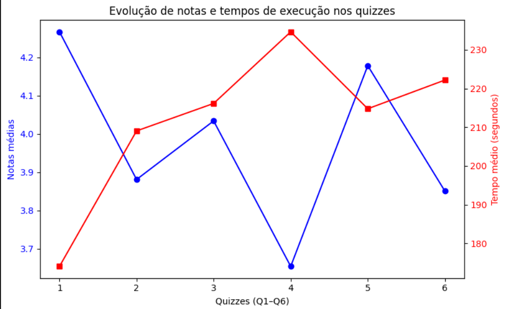
   <sup>Fonte: Material produzido pelos autores (2025)</sup>
</div>

<div align="center">
   <sub>Figura - Relação tempo/nota dos quizzes do segundo período</sub>
   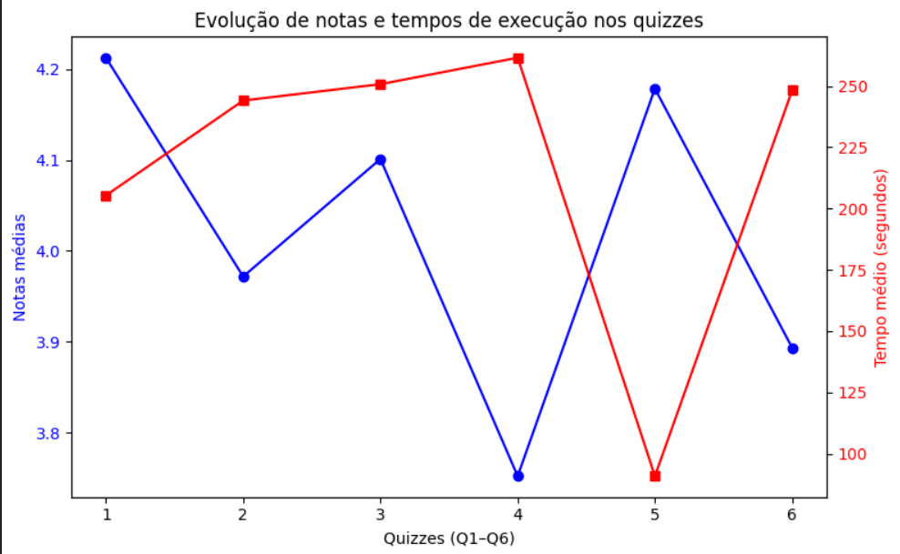
   <sup>Fonte: Material produzido pelos autores (2025)</sup>
</div>

### Exclusões realizadas  
Apesar da relevância teórica, algumas variáveis não foram incluídas no modelo final:  

- **Parcial_2, Projeto_Parte1 e Projeto_Parte2**: não foram utilizadas por não estarem dentro do espectro temporal em que o modelo será aplicado (objetivo é prever risco **antes** dessas avaliações).  
- **Oficinas**: descartadas, pois havia apenas a média final agregada. Seria necessário acesso às notas individuais de cada oficina para capturar evolução.  
- **Período, Grupo e Horário**: não foram usados por se tratarem de atribuições essencialmente aleatórias (ex.: grupo de trabalho), sem valor preditivo consistente.  
- **Gênero e Idade**: embora presentes, não foram considerados. Todos os alunos estavam na faixa de **maiores de idade**, não havendo variação significativa. Já o campo **Gênero** não apresentou diferenciação suficiente para ser efetivo no modelo.  


---

## 4.3.2. Organização dos Dados  

O problema foi formulado como **classificação binária**, tendo **Reprovou** como variável alvo. Em análises futuras, há a possibilidade de explorar **Nota_Oficial** em um cenário de regressão, posteriormente convertido em aprovação/reprovação por limiar institucional.  

### Divisão dos dados  
- Foi utilizada apenas a separação em **treino (80%)** e **teste (20%)**, estratificados pela variável-alvo.  
- Não foi aplicada validação cruzada, pois o foco inicial está em avaliar a viabilidade do modelo em condições práticas de aplicação e por da margem de dados fornecidas par a aplicação.  

 <div align="center">
   <sub>Figura - Divisão dos dados</sub>
   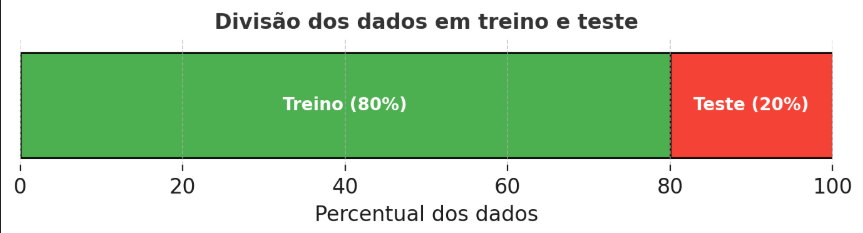
   <sup>Fonte: Material produzido pelos autores (2025)</sup>
</div>

### Pré-processamento  
O pré-processamento foi realizado **sobre o banco completo** antes da separação entre treino e teste. As etapas incluíram:  

- Padronização de colunas e valores.  
- Conversão dos tempos dos quizzes para segundos.  
- Tratamento de valores ausentes.  
- Clipping de outliers.  
- Codificação **One-Hot** para variáveis categóricas mantidas.  

### Tratamento de desbalanceamento  
- Como a variável alvo apresenta algum desbalanceamento, avaliou-se o uso de **class_weight=balanced** e técnicas de oversampling (ex.: SMOTE).  
- Esses métodos foram aplicados exclusivamente no conjunto de treino.  

 <div align="center">
   <sub>Figura - Divisão dos dados</sub>
   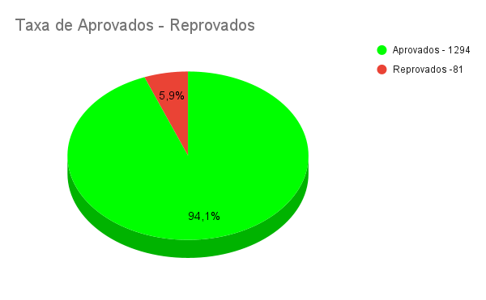
   <sup>Fonte: Material produzido pelos autores (2025)</sup>
</div>

### Reprodutibilidade  
- Foram fixadas sementes aleatórias nos processos de amostragem e modelagem.  
- O pipeline (lista final de colunas, encoders, mapeamentos e escalonadores) foi versionado, garantindo replicabilidade e auditabilidade institucional.  


### 4.3.3 Métricas relacionadas ao modelo

&emsp; Métricas são utilizadas para avaliar o desempenho durante o desenvolvimento do modelo preditivo supervisionado.

&emsp; Em cenários desbalanceados, como este (94% de aprovação e 6% de reprovação), a acurácia por si só pode ser enganosa: um modelo que sempre prevê a classe majoritária (aprovação) pode ter alta acurácia e, ainda assim, pouca utilidade prática.

&emsp; Métricas baseadas na matriz de confusão fornecem uma visão mais detalhada das previsões. Como o objetivo principal é identificar corretamente todos os alunos reprovados, o recall da classe minoritária (reprovação) se torna a métrica mais importante, pois mede a proporção de casos positivos reais que foram corretamente identificados pelo modelo.

<div align="center">
  <sub>Figura x — Matriz de confusão do modelo Nearest Centroid na etapa 1</sub><br>
  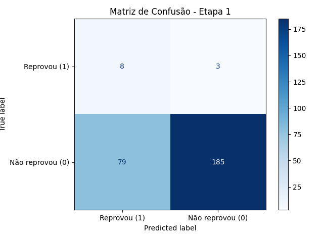<br>
  <sup>Fonte: Material produzido pelos autores (2025)</sup>
</div>

Interpretação da Matriz:

```
            Previsto: 1     Previsto: 0
Real: 1        VP               FN
Real: 0        FP               VN
```

- Verdadeiro Positivo (VP): o modelo prevê “Reprovou” e a pessoa realmente reprovou.
- Falso Positivo (FP): o modelo prevê “Reprovou”, mas a pessoa não reprovou.
- Verdadeiro Negativo (VN): o modelo prevê “Não reprovou” e a pessoa de fato não reprovou.
- Falso Negativo (FN): o modelo prevê “Não reprovou”, mas a pessoa reprovou.

A classe positiva (“Reprovou”) é minoritária e crítica. Dessa forma, reduzir FN — isto é, evitar deixar de identificar alunos que irão reprovar — é a prioridade.

#### Métricas-chave

##### Recall
- Fórmula: Recall = VP / (VP + FN)
- Definição: proporção de positivos reais corretamente identificados.
- Interpretação: “Entre os que realmente reprovam, quantos o modelo detecta?”
- Observação: o grid search utiliza `scoring='recall'`, indicando que perder um caso de reprovação (FN) é mais custoso do que gerar um alarme a mais (FP). Assim, o modelo prioriza identificar o máximo de casos de reprovação, mesmo que isso aumente o número de alarmes falsos.

##### Precisão
- Fórmula: Precisão = VP / (VP + FP)
- Definição: proporção de positivos previstos que são de fato positivos.
- Interpretação: “Entre os marcados como reprovados, quantos realmente reprovam?”
- Observação: em dados desbalanceados, ao elevar o recall, é comum aumentar FP e reduzir a precisão. A precisão ajuda a controlar a confiabilidade das sinalizações de reprovação.

##### F1-Score
- Fórmula: F1 = 2 × (Precisão × Recall) / (Precisão + Recall)
- Definição: média harmônica entre precisão e recall.
- Interpretação: equilíbrio entre capturar a maioria dos reprovados e manter previsões positivas confiáveis.
- Observação: útil para balancear FN e FP. Como o custo de FN é maior, o recall é priorizado; ainda assim, o F1 é monitorado para evitar colapso da precisão.

### 4.3.4 Modelo Candidato — Nearest Centroid

#### Descrição do modelo
# Nearest Centroid (NC)

&emsp; O **Nearest Centroid** é um classificador simples baseado em distância. Para cada classe, calcula-se o **centróide** (média dos vetores) no conjunto de treino. Uma nova amostra é atribuída à classe cujo centróide estiver mais próximo, de acordo com uma métrica de distância selecionada (`metric`).  

Para otimizar o modelo neste cenário desbalanceado, foram aplicadas as seguintes estratégias:  

- **Busca em grade (GridSearchCV)** com validação cruzada (cv=5) para escolher os melhores hiperparâmetros: `metric` e `shrink_threshold`.  
- **Otimização por recall**, dado que o objetivo principal é reduzir falsos negativos (FN) na classe positiva (“Reprovou” = 1).  
- Conjunto de dados dividido em treino e teste com `random_state=42`.  
- Consideração do uso de **SMOTE** no treino (comentado no código) para lidar com o desbalanceamento.  

---

## Resultados por pontos no tempo

### Tabela 1 – Menos atributos
- **Recall:** razoável/alto  
- **Precisão:** muito baixa (muitas sinalizações incorretas – FP)  
- **Observação:** com pouca informação, o NC tende a “abrir a rede” para capturar reprovados, mas gera muitos alarmes falsos.  

<div align="center">
  <sub>Figura x — Matriz de confusão 1 do Nearest Centroid</sub><br>
  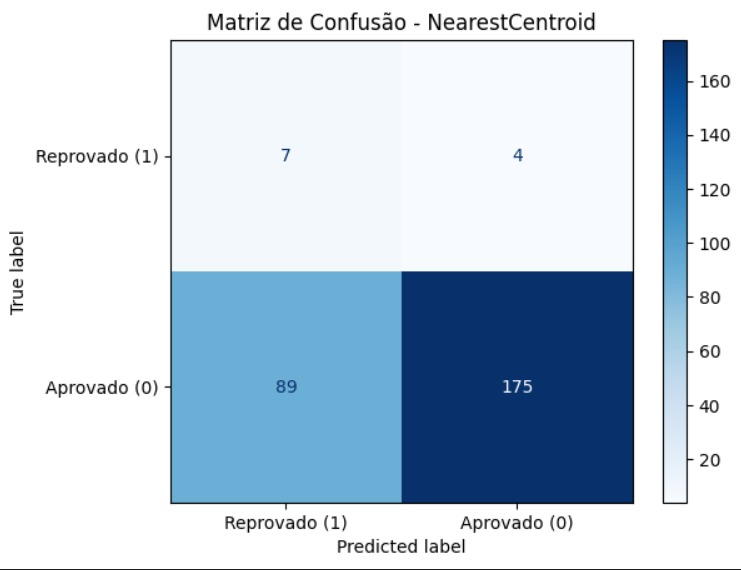<br>
  <sup>Fonte: Material produzido pelos autores (2025)</sup>
</div> 

---

### Tabela 2 – Informação intermediária
- **Recall:** muito alto  
- **Precisão:** ainda modesta  
- **F1-score:** melhora em relação à Tabela 1  
- **Observação:** o modelo continua eficaz em detectar reprovados, mas o custo de FP ainda é relevante.  

<div align="center">
  <sub>Figura x — Matriz de confusão 2 do Nearest Centroid</sub><br>
  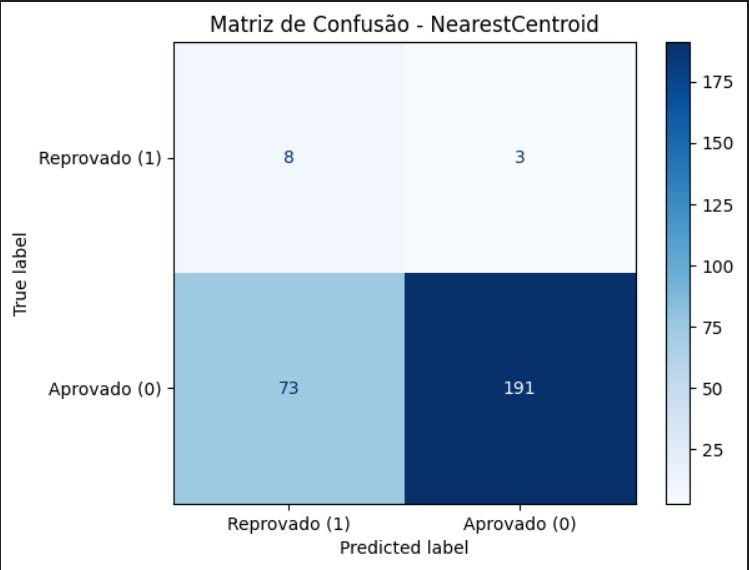<br>
  <sup>Fonte: Material produzido pelos autores (2025)</sup>
</div> 

---

### Tabela 3 – Mais atributos
- **Recall:** alto  
- **Precisão e F1:** leve melhora  
- **Observação:** com mais variáveis, o NC consegue reduzir um pouco os FP, mantendo foco em recall.  

<div align="center">
  <sub>Figura x — Matriz de confusão 3 do Nearest Centroid</sub><br>
  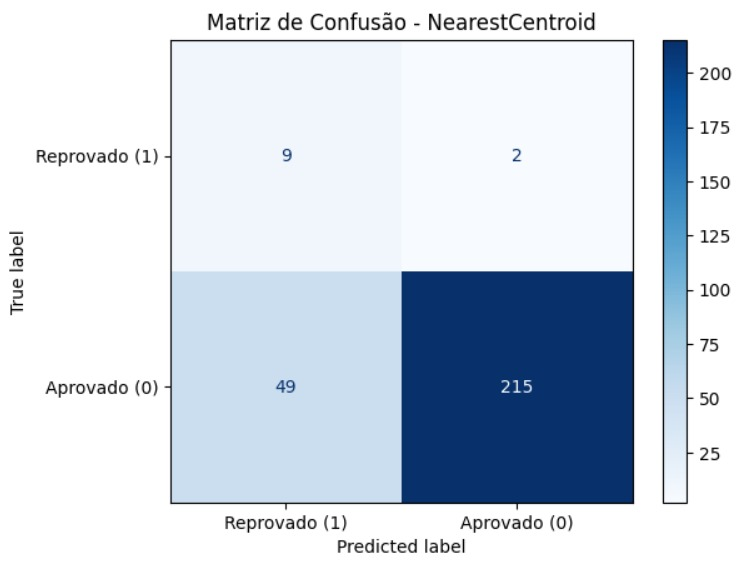<br>
  <sup>Fonte: Material produzido pelos autores (2025)</sup>
</div> 

---

## Ajuste ao desbalanceamento

&emsp; O problema é desbalanceado (poucos “Reprovou”). Como o NC é simples e otimizado por **recall**, ele favorece a classe positiva:  

- Reduz FN (detecta mais reprovados)  
- Pode reduzir precisão (aumenta FP)  

&emsp; O uso de **SMOTE** foi previsto apenas no conjunto de treino, para evitar vazamento de informação. Ele cria exemplos sintéticos da classe minoritária, equilibrando o treino e permitindo potencial aumento de recall sem inflar FP no teste.  

---

## Próximos passos

1. **Avaliar o efeito do SMOTE** apenas no treino e repetir a busca de hiperparâmetros.  
2. **Ajustar `shrink_threshold`** para maior seletividade (redução de FP).  
3. **Comparar com outros modelos**: testamos **XGBoost** e outros classificadores com limiar ajustável, que apresentam menor FP.  
<div align="center">
  <sub>Figura x — Matriz de confusão XGBClassifier</sub><br>
  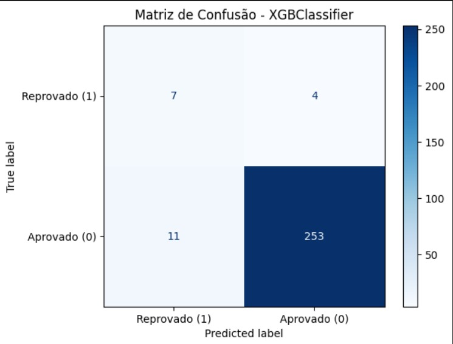<br>
  <sup>Fonte: Material produzido pelos autores (2025)</sup>
</div> 

4. **Criar ensemble (VotingClassifier)** para combinar os pontos fortes do NC (alto recall) e de modelos como XGBoost (menor FP).  

Exemplo de código Python:

```python
from sklearn.ensemble import VotingClassifier
from sklearn.neighbors import NearestCentroid
from xgboost import XGBClassifier

nc = NearestCentroid(shrink_threshold=0.5)
xgb = XGBClassifier(scale_pos_weight=15, use_label_encoder=False, eval_metric='logloss')

ensemble = VotingClassifier(
    estimators=[('nc', nc), ('xgb', xgb)],
    voting='soft'  
)
ensemble.fit(X_train, y_train)
y_pred = ensemble.predict(X_test)

```
### 4.4. Comparação de Modelos


&emsp; Na seção anterior, foi apresentado o modelo candidato ao projeto da EAFIT: o Nearest Centroid. Nesta seção, serão discutidos outros dois modelos, com o objetivo de prever com **eficiência a reprovação de alunos** da universidade.

&emsp; Ao final desta seção, espera-se **definir o modelo mais apropriado para o projeto**. Após o refinamento, os modelos serão comparados utilizando métricas quantitativas primárias, como o **Recall (para minimizar Falsos Negativos na classificação de risco)** e o **F1-Score (para avaliar o equilíbrio entre Precisão e Recall do modelo)**. Além disso, seus resultados serão avaliados quanto à **capacidade de fornecer explicabilidade das predições**, convertendo a saída do modelo em insights úteis e acionáveis para o parceiro.


#### 4.4.1 Métricas

&emsp; Em processos de aprendizado supervisionado e classificação, a qualidade das predições geradas é avaliada com métricas de validação externa, ou seja, um cruzamento entre os resultados disponibilizados pelo output do modelo com os resultados reais da base de dados. Diferentemente do agrupamento de uma métrica como precisão, o foco se desloca para o custo de erros específicos, dentro da dinâmica da solução desenhada ao parceiro. No contexto da EAFIT, onde o principal objetivo é a **intervenção precoce em prol do combate de reprovações**, o **custo de um Falso negativo (não identificar um aluno em risco real), é muito mais elevado do que o de um Falso positivo**.

&emsp; Nesse sentido, o **Recall (ou Sensibilidade) é a métrica primária selecionada**. O Recall mede a **proporção de casos positivos verdadeiros que foram corretamente identificados pelo modelo**, refletindo sua capacidade de encontrar todos os alunos que estão realmente em risco. Uma das principais vantagens do Recall é sua relevância direta para o problema de intervenção, pois um alto valor **garante que a equipe da EAFIT terá o maior número possível de alunos de alto risco sob observação**. Por outro lado, a otimização excessiva do Recall pode levar a uma queda na Precisão, resultando em um alto número de Falsos Positivos, alunos seguros sendo classificados erroneamente como de risco, o que pode gerar sobrecarga de trabalho e diluir o foco da equipe de apoio.

&emsp; A **F1-Score, que mede o desempenho geral do modelo ao calcular a média harmônica entre Precisão e Recall, é a segunda métrica essencial**. O F1-Score é um **excelente indicador para conjuntos de dados desbalanceados** ou quando se busca um **equilíbrio entre a capacidade de encontrar todos os casos de risco (Recall) e a capacidade de garantir que as predições de risco sejam, de fato, corretas (Precisão)**. Neste caso, um valor elevado de F1-Score indica que o modelo é robusto e não está excessivamente enviesado em direção a nenhuma das duas métricas. Contudo, seu valor, sendo um cálculo agregado, pode ser menos intuitivo para a tomada de decisão do parceiro em comparação com os valores diretos de Recall ou Precisão.

#### 4.4.2 Algoritmos para otimização de hiperparâmetros

&emsp; O conceito de hiperparâmetros é fundamental em Machine Learning, sendo estes definidos como **variáveis de configuração externas ao modelo, estabelecidas manualmente antes do processo de treinamento** [CODESIGNAL].

&emsp; Eles são distintos dos parâmetros do modelo, que são variáveis internas aprendidas a partir dos dados durante o treinamento (como pesos), e têm a função de **governar o processo de aprendizado e a complexidade do estimador**. A **otimização desses hiperparâmetros é crucial para a performance e generalização do modelo**, sendo o **GridSearchCV (Grid Search Cross-Validation) um dos métodos de busca mais tradicionais**.

&emsp; Implementado na biblioteca Scikit-Learn, o GridSearchCV realiza uma **busca exaustiva, testando todas as combinações de valores discretos predefinidos na grade de parâmetros** [CODESIGNAL], o snippet abaixo demonstra um uso básico da ferramenta:

`````python
from sklearn.model_selection import GridSearchCV
from sklearn.neighbors import NearestCentroid
import numpy as np

# Definição do modelo
modelo = NearestCentroid()

# Grade de Hiperparâmetros
param_grid = {
    'metric': ['euclidean', 'manhattan'],
    'shrink_threshold': [None, 0.1, 0.5, 1.0] # 'None' desativa o shrinkage
}

# Configuração do Grid Search
grid_search = GridSearchCV(
    estimator=modelo, 
    param_grid=param_grid, 
    cv=3,                      
    scoring='accuracy'         
)

# Resultado após .fit(X_train, y_train)
grid_search.best_params_
`````


#### 4.4.3 Modelos


#### 4.4.3.1 AdaBoost

&emsp; O AdaBoost (Adaptive Boosting) é um algoritmo de ensemble que combina vários classificadores fracos para formar um classificador forte. A ideia central é treinar, de forma sequencial, modelos mais simples (no caso, árvores de decisão rasas) que se concentram progressivamente nos exemplos mais difíceis de classificar da seguinte forma: em cada iteração, o algoritmo atribui pesos maiores às amostras que foram classificadas incorretamente na iteração anterior, forçando os classificadores seguintes a dar mais atenção a esses casos. E de maneira formal, a função preditiva do AdaBoost é definida como:

$$
H(x) = \text{sign} \left( \sum_{t=1}^{T} \alpha_t h_t(x) \right)
$$

&ensp; Onde \(h_t(x)\) é o classificador fraco treinado na t-ésima iteração, \(\alpha_t\) é o peso atribuído ao classificador (maior para classificadores que erraram menos) e \(T\) é o número total de iterações. E \(\text{sign}\) significa que estamos falando de uma *função sinal*, que retorna apenas o sinal do seu argumento, por exemplo:

&ensp; Seja \(z=\sum_{t=1}^{T} \alpha_t h_t(x)\)

$$
\text{sign}(z) =
\begin{cases}
+1, & \text{se } z > 0 \\
-1, & \text{se } z < 0 \\
0,  & \text{se } z = 0
\end{cases}
$$

&ensp; Então a intuição principal é: se o somatório \(\sum_{t=1}^{T} \alpha_t h_t(x)\), que é a combinação linear das predições dos modelos fracos com os seus pesos, tiver valor positivo, então a decisão final do modelo \(H(x)=+1\), que no caso do projeto, seria um aluno reprovado (classe priorizada no projeto). Analogamente, se a decisão final fosse \(H(x)=-1\), então teríamos um aluno aprovado.

&ensp; A otimização dos hiperparâmetros do Adaboost foi realizada semanalmente utilizando o Grid Search Cross-Validation (GridSearchCV) para maximizar o desempenho na identificação da classe minoritária (Reprovado), quesito central na avaliação da qualidade do modelo, resultando nos seguintes outputs: 

| Período de Análise | Learning_rate | n_estimators  |
|---------------------|---------------|--------------|
| Semana 6            | 0.1           | 50           | 
| Semana 8            | 0.01          | 200          | 
| Semana 12           | 0.01          | 200          | 

&ensp; Sob esses hiperparâmetros, o modelo retorna as seguintes métricas:

| Janela de Análise | Recall Classe 0 | f1_score |
|---------------------|-----------------|----------|
| Semana 6            | 0.8076          | 0.3387   |
| Semana 8            | 0.6538          | 0.4594   |
| Semana 12           | 0.6923          | 0.4931   |


#### Hiperparâmetros AdaBoostClassifier 

##### Hiperparâmetros que **vão ser utilizados**


| Parâmetro        | O que faz / Para que serve | Valores sugeridos / Observações |
|------------------|---------------------------|--------------------------------|
| `n_estimators`   | Número máximo de estimadores fracos a serem treinados. Controla quantas árvores/estimadores serão construídos no ensemble. | `[50, 100, 200]` - Mantido pequeno para evitar overfitting em dataset pequeno |
| `learning_rate`  | Peso aplicado às contribuições de cada estimador. Controla a taxa de aprendizado do ensemble. | `[0.01, 0.1, 0.5]` - Valores menores ajudam na generalização, maiores aceleram convergência |
| `algorithm`      | Define como os pesos das observações são atualizados durante o boosting. | `"SAMME.R"` - Probabilístico, recomendado para classificação binária/multiclasse |
| `random_state`   | Semente aleatória para garantir reprodutibilidade. | `[42]` |

---

##### Hiperparâmetros que **não vão ser utilizados**

| Parâmetro        | O que faz / Para que serve | Motivo de não uso |
|------------------|---------------------------|-----------------|
| `loss`           | Define a função de perda para regressão. | Apenas para AdaBoostRegressor, não usado em classificação |
| `base_estimator` | Modelo fraco que será usado no boosting. | Fixado em `DecisionTreeClassifier(max_depth=1)`, não será variado no grid |


#### 4.4.3.2 XGBoost

&ensp; O XGBoost (Extreme Gradient Boosting) é um algoritmo de ensemble (aprendizado em conjunto) baseado em árvores de decisão sequenciais, otimizadas através da técnica de gradient boosting. Sua principal característica é a construção de árvores em sequência, onde cada nova árvore é treinada para minimizar o erro residual do conjunto anterior, garantindo um aprendizado mais forte a partir de classificadores mais fracos.


&ensp; A função objetivo do XGBoost é definida da seguinte forma:

$$
\mathcal{L}(\phi) = \sum_{i=1}^{n} l(y_i, \hat{y}_i) + \sum_{k=1}^{K} \Omega(f_k)
$$

&ensp; Onde \(n\) é  número de alunos monitorados, \(K\) é o número de árvores envolvidas no processo de boosting, \(\hat{y}_i\) é a predição acumulada até a iteração atual.


&ensp; O termo $\sum_{i=1}^{n} l(y_i, \hat{y}_i)$ é a *função de perda*, que mede a discrepância entre o rótulo verdadeiro \(y_i\) e a predição \(\hat{y}_i\) do modelo para cada ponto \(i\) da amostra. E a escolha da função de perda depende do contexto de aplicação do modelo, em problemas de classificação como o nosso caso, normalmente utiliza-se a função *log-loss*. E \(\sum_{k=1}^{K} \Omega(f_k)\) é o *termo de regularização*, que adiciona uma "penalização" para cada árvore \(f_k\) do ensemble (conjunto de modelos mais fracos) a fim de controlar a complexidade do modelo, e assim evitar o overfitting.


&ensp; E por fim, o termo $\Omega(f_k)$, responsável por penalizar as árvores "complexas demais" é calculado por:


$$
\Omega(f) = \gamma T + \frac{1}{2} \lambda \|w\|^2
$$


&ensp; Em \(\gamma T\) o parâmetro \(\gamma\) mede o limiar de complexidade de uma árvore, que será proporcional ao seu número \(T\) de folhas, e quanto maior for o número de folhas, maior será a complexidade, e maior será a penalização. E \(\frac{1}{2} \lambda \|w\|^2\) representa a regularização L2 (*L2 é a norma Euclidiana, que siginifica que valores que seriam grandes a priori serão suvizados*) aplicada aos pesos (\(w\)) e o parâmetro \(\lambda\) controla a intensidade da penalização. Folhas que teriam pesos muito elevados, que poderiam indicar overfitting, são suavizadas pela *norma Euclidiana* (L2).

&ensp; A otimização dos hiperparâmetros do XGBoost foi realizada semanalmente utilizando o Grid Search Cross-Validation (GridSearchCV) para maximizar o desempenho na identificação da classe minoritária (Reprovado), quesito central na avaliação da qualidade do modelo, resultando nos seguintes outputs:


| Período de Análise | Learning_rate | n_estimators | max_depth | three_method |
|---------------------|---------------|--------------|----------|--------------|
| Semana 6            | 0.1           | 200          | 7        | auto         |
| Semana 8            | 1.0           | 300          | 7        | auto         |
| Semana 12           | 0.1           | 100          | 5        | auto         |

Sob esses hiperparâmetros, o modelo retorna as seguintes métricas:

| Janela de Análise | Recall Classe 0 | f1_score |
|---------------------|-----------------|----------|
| Semana 6            | 0.7692          | 0.3960   |
| Semana 8            | 0.5384          | 0.5384   |
| Semana 12           | 0.5384          | 0.5957   |

#### Hiperparâmetros XGBoost

##### Hiperparâmetros que **vão ser utilizados**

| Parâmetro       | O que faz / Para que serve | Valores sugeridos / Observações |
|-----------------|---------------------------|--------------------------------|
| `max_depth`     | Profundidade máxima da árvore. Controla o quão complexas podem ser as divisões e ajuda a evitar overfitting. | `[3, 5, 7, 10]` |
| `n_estimators`  | Número de árvores (rounds de boosting) a serem construídas. | `[50, 100, 200]` (dataset pequeno) |
| `learning_rate` | Define quanto cada árvore contribui para a predição final. Controla a taxa de aprendizado do ensemble. | `[0.001, 0.01, 0.1]` |
| `tree_method`   | Define o algoritmo usado para construir árvores. Evita usar `updater` diretamente, mais seguro para GridSearch. | `auto` (suficiente para datasets pequenos/médios) |
| `random_state`   | Semente aleatória para garantir reprodutibilidade. | `[42]` |

---

##### Hiperparâmetros que **não vão ser utilizados**

| Parâmetro | O que faz / Para que serve | Motivo de não uso |
|-----------|---------------------------|-----------------|
| `interaction_constraints` | Restringe quais features podem interagir entre si. | Não necessário, poucas features |
| `monotone_constraints` | Impõe monotonicidade entre features e predição. | Não necessário |
| `refresh_leaf` | Usado com updater “refresh” para atualizar folhas/nós. | `updater` não será usado |
| `updater` | Define sequência de updaters internos. | Baixo nível, pode quebrar GridSearch → substituído por `tree_method` |
| `process_type` | Tipo de processo de boosting (default/update). | Não relevante para caso binário padrão |
| `grow_policy` | Política de crescimento de árvores (`depthwise` ou `lossguide`). | Padrão `depthwise` suficiente |
| `max_leaves` | Número máximo de folhas. | Só funciona com `lossguide`, não usado porque `max_depth` já controla complexidade |
| `max_bin` | Número máximo de bins para discretização de variáveis contínuas. | Default suficiente, dataset pequeno |
| `predictor` | Algoritmo usado para predição (CPU/GPU). | Não usado, sem GPU |
| `num_parallel_tree` | Número de árvores construídas em paralelo. | Não necessário, modelo pequeno e foco em F1/Recall |
| `sample_type` | Apenas DART. | Não será usado |
| `normalize_type` | Apenas DART. | Não será usado |
| `rate_drop` | Apenas DART. | Não será usado |
| `skip_drop` | Apenas DART. | Não será usado |
| `one_drop` | Apenas DART. | Não será usado |
| `max_cat_to_onehot` | Limite de categorias para one-hot encoding. | Poucas features categóricas |
| `max_cat_threshold` | Threshold para dividir categorias. | Poucas features categóricas |
| `deterministic_histogram` | Para `gpu_hist`, garante histograma determinístico. | Sem GPU |
| `tweedie_variance_power` | Para regressão Tweedie. | Problema binário → não usado |
| `huber_slope` | Para pseudo-Huber. | Problema binário → não usado |
| `quantile_alpha` | Para regressão quantil. | Problema binário → não usado |
| `aft_loss_distribution` | Para AFT (modelos de sobrevivência). | Problema binário → não usado |
| `aft_loss_distribution_scale` | Para AFT. | Problema binário → não usado |
| `top_k` | Para seleção de features em boosters lineares. | Não usado (problema de classificação binária) |
| `feature_selector` | Método de seleção de features em boosters lineares. | Não usado |
| `lambda_bias` | Regularização L2 no bias. | Só para boosters lineares, não usado |
| `multi_strategy` | Para múltiplos alvos / multiclasses. | Problema binário → não usado |
| `max_cached_hist_node` | Número máximo de nós de histograma em cache (GPU). | Sem GPU |
| `seed_per_iteration` | Reinicia semente a cada iteração (reprodutibilidade). | Não será usado |
| `use_rmm` | Usa gerenciador de memória GPU. | Sem GPU |


##### 4.4.3.3 Nearest Centroid

&ensp; O Nearest Centroid é um algoritmo de classificação supervisionado baseado em distância, que se destaca por sua simplicidade interpretabilidade. O algoritmo classifica novas amostras com base na sua proximidade à média vetorial das amostras (chamada de centroide) de cada classe, assim, a nova instância de dado terá a classificação atribuída ao centroide mais próximo.

&ensp; De maneira formal, dado um conjunto de dados de treinamento \(\{(x_i, y_i)\}_{i=1}^n\) em que cada \(x_i \in \mathbb{R}^d\) representa um vetor de atributos e \(y_i \in \{1, \dots, K\}\) representa a classe atribuída ao vetor \(x_i\). E o centroide da classe \(K\) é definido como:

$$
c_k = \frac{1}{|C_k|} \sum_{i \in C_k} x_i
$$

&ensp; Onde \(C_k\) representa o conjunto de índices pertencentes à classe \(k\). E a predição para uma nova instância \(x\) é realizada escolhendo o centroide mais próximo:

$$
\hat{y} = \arg\min_{k} \; d(x, c_k)
$$

&ensp; Onde \(c_k\) é o centroide da classe \(k\) ou seja, o ponto médio que generaliza, ou resume o comportamento dessa classe. O termo \(d(x, c_k)\) representa a distância da nova instância \(x\) até o centroide, calculada pela distância Euclidiana (padrão da literatura), ou pela distância Manhattan (para bases com muitas dimensões). E o operador \(\arg\min\) quer dizer que o modelo escolhe a classe cujo centroide está mais próximo da nova instância \(x\). No contexto do projeto, o modelo compara um novo estudante com os perfis médios de aprovados e reprovados e decide, pela distância ao centróide, a qual classe ele mais se assemelha.

&ensp; A otimização dos hiperparâmetros do Nearest Centroid foi realizada semanalmente utilizando o Grid Search Cross-Validation (GridSearchCV) para maximizar o desempenho na identificação da classe minoritária (Reprovado), quesito central na avaliação da qualidade do modelo, resultando nos seguintes outputs:

| Período de Análise  | Metric        | shrink_threshold |
|---------------------|---------------|--------------|
| Semana 6            | Manhattan     | None         |
| Semana 8            | Manhattan     | None         |
| Semana 12           | Manhattan     | None         |

&emsp; Sob estes hiperparâmetros, o modelo retorna as seguintes métricas. 

| Janela de Análise   | Recall Classe 1 | f1_score |
|---------------------|-----------------|----------|
| Semana 6            | 0.8076          | 0.4285   |
| Semana 8            | 0.7692          | 0.5405   |
| Semana 12           | 0.7307          | 0.6909   |

#### Hiperparâmetros Nearest Centroid

##### Hiperparâmetros que vão ser utilizados

| Parâmetro       | O que faz / Para que serve | Valores sugeridos / Observações |
|-----------------|---------------------------|--------------------------------|
| `metric`| Define qual método será utilizado para o cálculo das distâncias. | `euclidian, manhattan` |
| `shrink_threshold`  | Move os centroides em direção à média global da base de dados, tornando o modelo menos sensível a outliers. | `[None, 0.1, 0.5, 1.0]` |

##### Hiperparâmetros que **não vão ser utilizados**

| Parâmetro | O que faz / Para que serve | Motivo de não uso |
|-----------|---------------------------|-----------------|
| `prior` | Define a probabilidade a priori de uma classe. | As classes são muito desbalanceadas, então não utilizamos para evitar overfitting e falsos negativos e falsos positivos. |

##### Explicabilidade do Nearest Centroid com SHAP

&emsp; O modelo preditivo foi treinado em 3 etapas diferentes(semanas 6,8,12) e avaliado quanto à contribuição de cada variável de entrada para suas previsões utilizando **SHAP (SHapley Additive exPlanations)**. Os gráficos abaixo representam a importância de cada feature no output do modelo, onde cada ponto indica o impacto de uma observação específica.

&emsp; Para uma interpretação mais direta sobre o problema, a classe dos reprovados é tida como 1 e a dos aprovados como 0, isso implica na representação dos pesos no modelo, pesos negativos vão contra a classe positiva, os reprovados.

---

## Interpretação Geral

- **Eixo X**: valor SHAP, que representa o impacto de cada feature na previsão do modelo.  
  - Valores positivos indicam que a feature aumenta a probabilidade de saída positiva.  
  - Valores negativos reduzem essa probabilidade.

- **Eixo Y**: lista todas as features utilizadas.

- **Cor dos pontos**: indica o valor da feature, de **azul (baixo)** a **vermelho (alto)**.

---

### Análise por Semana

#### Semana 6
<div align="center">
  <sub>Figura x — Explicabilidade semana 6 Nearest Centroid</sub><br>
  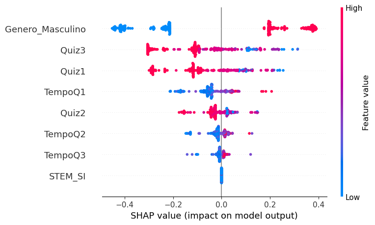<br>
  <sup>Fonte: Material produzido pelos autores (2025)</sup>
</div>

#### Semana 8
<div align="center">
  <sub>Figura x — Explicabilidade semana 8 Nearest Centroid</sub><br>
  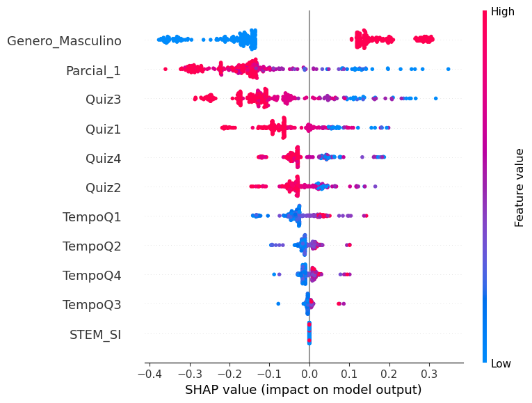<br>
  <sup>Fonte: Material produzido pelos autores (2025)</sup>
</div>

#### Semana 12
<div align="center">
  <sub>Figura x — Explicabilidade semana 12 Nearest Centroid</sub><br>
  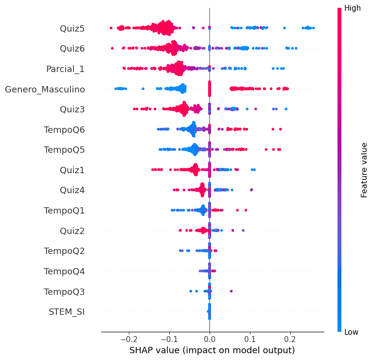<br>
  <sup>Fonte: Material produzido pelos autores (2025)</sup>
</div>


# Insights do Modelo Preditivo (SHAP) – Gráfico Atual

O gráfico acima mostra a contribuição de cada feature para a previsão do modelo utilizando **SHAP (SHapley Additive exPlanations)**.

---

## Interpretação Geral

- **Eixo X**: valor SHAP, representando o impacto da feature na previsão.  
  - Valores positivos → aumentam a previsão positiva.  
  - Valores negativos → reduzem a previsão positiva.

- **Eixo Y**: lista das features analisadas.

- **Cor dos pontos**: indica valor da feature, de **azul (baixo)** a **vermelho (alto)**.

---

# Insights do Nearest Centroid (SHAP) – Semanas 6, 8 e 12

## Semana 6

### Variável Demográfica
- **Genero_Masculino**  
  - Valores 0 (azul) tendem a **diminuir** a previsão.  
  - Valores 1 (vermelho) **aumentam** a previsão positiva.  

### Quizzes
- **Quiz1 e Quiz3**  
  - Valores altos (vermelho) aumentam a previsão negativa do modelo(aprovados).  
  - Valores baixos (azul) aumentam a previsão postiva do modelo(reprovados).  
- **Quiz2**  
  - Impacto mais neutro, mas ainda com efeito relevante, principalmente valores altos, esses que jogam para a classe negativa(reprovados).
- **Análise final**
  - Notas mais alta tendem a identificar o modelo como aprovado.

### Variáveis de Tempo
- **TempoQ1, TempoQ2 e TempoQ3**  
  - Valores baixos (azul) reduzem a previsão do reprovados.  
  - Valores altos (vermelho) aumentam a previsão do reprovados.
- **Análise final**
  - Tempos de resposta dos quizzes mais baixos tendem a classificar como reprovado.

### Outras Features
- **STEM_SI**: impacto mínimo no modelo, sugerindo baixa relevância e reforçando a análise anterior de que STEM não influenciava na predição.


---

## Semana 8

### Variável Demográfica
- **Genero_Masculino**  
  - Valores 0 (azul) tendem a diminuir a previsão.  
  - Valores 1 (vermelho) aumentam a previsão positiva.  

### Avaliações e Quizzes
- **Parcial_1, Quiz1, Quiz2, Quiz3, Quiz4**  
  - Valores altos (vermelho) aumentam a previsão negativa(aprovados).  
  - Valores baixos (azul) reduzem a previsão negativa(aprovados).  
  - **Parcial_1** e **Quiz3** mostram maior dispersão → efeito não-linear.  
  - **Quiz2**: impacto neutro, mas relevante, notas mais altas jogam um pouco para a classe dos aprovados.
- **Análise final**
  - Notas altas continuam influenciando na predição da classe dos aprovados no modelo(negativa) mas agora com algumas dispersões.

### Variáveis de Tempo
- **TempoQ1, TempoQ2, TempoQ3, TempoQ4**  
  - Valores altos (vermelho) aumentam a previsão da classe positiva(reprovados).  
  - Valores baixos (azul) reduzem a previsão da classe positiva(aprovados).
- **Análise final**
  - Tempos mais altos de resolução dos quizzes continuam influenciando na classificação de reprovados pelo modelo.  

### Outras Features
- **STEM_SI**: impacto mínimo no modelo.
---

## Semana 12

### Variável demográfica
- **Genero_Masculino**  
  - Valores baixos (azul) podem impactar positivamente.  
  - Valores altos (vermelho) podem reduzir a previsão.

### Avaliações e Quizzes
- **Parcial_1, Quiz5, Quiz6 e Quiz3**  
  - Valores altos (vermelho) aumentam a previsão negativa(aprovados).  
  - Valores baixos (azul) reduzem a previsão negativa(aprovados). 
- **Quiz1 e Quiz4**
  - Relevantes para o modelo mas em menor escala ao comparado com os quizzes 3, 5 e 6.  
- **Quiz2** 
  - Impacto neutro, mas relevante.
- **Análise final**
  - Notas altas continuam influenciando na predição da classe dos aprovados no modelo(negativa) mas agora com algumas dispersões.

### Variáveis de tempo
- **TempoQ1 a TempoQ6** têm impacto menor, mas ainda relevante, tempos menores mais relacionados com a classe negativa(aprovados).  
- **TempoQ5 e TempoQ6**: valores altos (vermelho) aumentam a previsão → dedicação ou engajamento.

### Outras observações
- **STEM_SI**: baixo impacto geral.  
- Algumas features apresentam efeito **não-linear** ou **interações**, visível na dispersão.
- **Análise final**
  - Notas de quizzes iniciais já não são tão relevantes para o modelo.

---

## Interpretação dos Resultados

O gráfico **SHAP** permite analisar a influência de cada feature na predição:  

- Pontos em vermelho estão relacionados à classe "reprovado".  
- **Notas de quizzes** impactam negativamente a classe "reprovado": quanto maior a nota, maior a probabilidade de ser previsto como aprovado.  

A análise combinada do SHAP com essas métricas reforça a **interpretabilidade** do modelo e auxilia na tomada de decisão pedagógica.


#### 4.4.5 Comparação dos Modelos Testados 

Semana 06: 

| Modelo | Recall (Classe 1) | F1-Score (Classe 1) |
| :---: | :---: | :---: |
| **Nearest Centroid** | **0.8076** | **0.4285** |
| **AdaBoost** | **0.8076** | 0.3387 |
| XGBoost | 0.7692 | 0.3960 |

Semana 08: 

| Modelo | Recall (Classe 1) | F1-Score (Classe 1) |
| :---: | :---: | :---: |
| **Nearest Centroid** | **0.7692** | **0.5405** |
| AdaBoost | 0.6538 | 0.4594 |
| XGBoost | 0.5384 | 0.5384 |

Semana 12:

| Modelo | Recall (Classe 1) | F1-Score (Classe 1) |
| :---: | :---: | :---: |
| **Nearest Centroid** | **0.7307** | **0.6909** |
| AdaBoost | 0.6923 | 0.4931 |
| XGBoost | 0.5384 | 0.5957 |


&emsp; A comparação de modelos revela um padrão de desempenho que valida a escolha do **Nearest Centroid (NC)** como o classificador mais adequado para o objetivo central do projeto: a **intervenção precoce no combate à reprovação**.

&emsp; Na Semana 06, o momento mais estratégico para a atuação da equipe de apoio da EAFIT, o NC empata com o AdaBoost no valor **máximo de Recall (0.8076)**, garantindo que **mais de 80% dos alunos que irão reprovar** sejam sinalizados logo no início do curso. O empate é acompanhado por um **F1-Score superior (0.4285)**, o que estabelece o Nearest Centroid como a opção mais equilibrada e **confiável** para a primeira janela de intervenção.

&emsp; A superioridade do Nearest Centroid se consolida ao longo do semestre. Nas Semanas 08 e 12, o modelo lidera consistentemente em ambas as métricas, superando os algoritmos de *boosting*. Na Semana 08, o NC atinge **0.7692 de Recall** e **0.5405 de F1-Score**. Na conclusão da análise, na Semana 12, o modelo alcança o **pico de assertividade**, registrando um **F1-Score de 0.6909**, o mais alto de todos os modelos testados. Logo, o resultado demonstra que o NC evolui para uma **predição altamente confiável**, capaz de minimizar Falsos Positivos sem comprometer o Recall, que se mantém robusto em **0.7307**.


### 4.5. Avaliação do Modelo

&emsp; Para solucionar o problema de evasão e reprovação na matéria de Pensamento Computacional da universidade EAFIT, foi desenvolvido um modelo preditivo baseado no algoritmo *Nearest Centroid*. Este algoritmo foi selecionado por apresentar o melhor desempenho em métricas de classificação durante as semanas de previsão nas semanas 6, 8 e 12.

&emsp; O principal objetivo do modelo é identificar o maior número possível de alunos em risco real de reprovação. Por essa razão, a otimização focou em maximizar a métrica de **Recall (Sensibilidade)**. Isso significa que o sistema foi calibrado para minimizar os falsos negativos (não alertar um aluno que irá reprovar). Como consequência, o modelo pode gerar alguns falsos positivos (alertar um aluno que seria aprovado), uma decisão estratégica considerada mais benéfica, pois é melhor intervir preventivamente do que omitir um alerta crucial. Dessa forma, a solução atende às expectativas ao construir um sistema de alerta precoce eficaz.

&emsp; Adicionalmente, a solução foi integrada a um *dashboard* interativo. Esta ferramenta permite que professores e coordenadores monitorem o desempenho acadêmico das turmas, submetam novos dados para obter predições em tempo real e visualizem a situação de risco de cada estudante. O sistema mitiga as dores das personas envolvidas:

* **Aluno:** Recebe acompanhamento proativo e alertas sobre sua situação acadêmica.
* **Professor:** Obtém uma ferramenta para identificar e auxiliar alunos em momentos decisivos do semestre.
* **Diretor/Coordenador:** Ganha uma visão macro do desempenho acadêmico, permitindo a criação de estratégias institucionais mais eficazes.

#### 4.5.1. Plano de Contingência

&emsp; A implementação de um modelo preditivo em um ambiente acadêmico real exige a preparação para cenários adversos, onde o desempenho pode não atingir as expectativas. Para mitigar os riscos associados a possíveis falhas de predição, foi delineado um plano de contingência. O plano será ativado caso se observem certos gatilhos, como um aumento na taxa de reprovação geral em comparação com semestres anteriores, um excesso de falsos alarmes gerando intervenções desnecessárias, ou falhas críticas na detecção de alunos que acabam reprovando sem terem sido alertados.

&emsp; Ao identificar um desses gatilhos, as ações imediatas envolverão a suspensão dos alertas preditivos para evitar a propagação de informações incorretas, a mudança de uma estratégia de intervenção individual para uma coletiva e a comunicação da situação ao corpo docente, que será orientado a intensificar o acompanhamento geral dos estudantes. Em paralelo, serão aplicadas estratégias pedagógicas alternativas, como aulões de revisão, plantões de dúvidas e a coleta de feedback dos alunos para obter dados qualitativos. 

&emsp; Dessa maneira, caso o modelo preditivo não apresente os resultados esperados, o plano de contingência garante uma transição rápida e organizada para um sistema de suporte mais amplo, protegendo os alunos de possíveis falhas e utilizando a situação como uma oportunidade para coletar dados e aprimorar as estratégias pedagógicas da instituição.

#### 4.5.2. Explicabilidade e Análise de Viés do Modelo

&emsp; A interpretabilidade de um modelo é essencial para gerar confiança no sistema e, principalmente, para detectar vieses indesejados nos dados (MOLNAR, 2022). Para isso, foi utilizada a metodologia SHAP (*SHapley Additive exPlanations*) para analisar o impacto de cada variável nas previsões do modelo nas semanas 6, 8 e 12.

&emsp; Os gráficos SHAP (Figuras x, x e x) ordenam as variáveis pela sua importância global. Cada ponto no gráfico representa um aluno, e sua posição no eixo horizontal indica o impacto daquela variável na previsão final (valores positivos aumentam a chance de "reprovado", valores negativos aumentam a de "aprovado"). A cor indica o valor da variável (vermelho para alto, azul para baixo).

<div align='center'>
 <sup>Figura x: Análise de explicabilidade SHAP para o modelo da semana 6</sup>
 <br>
 
 <br>
 <sub>Fonte: Material produzido pelos autores (2025).</sub>
</div>
<br>
<div align='center'>
 <sup>Figura x: Análise de explicabilidade SHAP para o modelo da semana 8</sup>
 <br>
 
 <br>
 <sub>Fonte: Material produzido pelos autores (2025).</sub>
</div>
<br>
<div align='center'>
 <sup>Figura x: Análise de explicabilidade SHAP para o modelo da semana 12</sup>
 <br>
 
 <br>
 <sub>Fonte: Material produzido pelos autores (2025).</sub>
</div>

&emsp; A análise dos gráficos revelou os seguintes *insights*:

1.  **Desempenho Acadêmico:** Conforme esperado, as notas das avaliações (`Quiz1` a `Quiz6`, `Parcial_1`) são preditores-chave. Valores baixos empurram a previsão para reprovação, enquanto valores altos a direcionam para aprovação. Isso confirma que o modelo aprendeu uma lógica academicamente coerente.

2.  **Relevância de Cursos STEM:** A variável `STEM_SI` (se o aluno pertence a um curso de tecnologia) apresenta baixo impacto em todas as análises, mostrando que a aprovação de um aluno não está relacionado ao seu curso de interesse, mas sim ao seu desempenho individual.

## <a name="c5"></a>5. Conclusões e Recomendações
```
Escreva, de forma resumida, sobre os principais resultados do seu projeto e faça recomendações formais ao seu parceiro de negócios em relação ao uso desse modelo. Você pode aproveitar este espaço para comentar sobre possíveis materiais extras, como um manual de usuário mais detalhado na seção "Anexos". Não se esqueça também das pessoas que serão potencialmente afetadas pelas decisões do modelo preditivo e elabore recomendações que ajudem seu parceiro a tratá-las de maneira estratégica e ética.

Remova este bloco ao final
```

## <a name="c6"></a>6. Referências

[CODESIGNAL] Grid Search: Finding Optimal Model Parameters. Disponível em: https://codesignal.com/learn/courses/hypertuning-and-cross-validation/lessons/grid-search-finding-optimal-model-parameters. Acesso em: 25 set. 2025.

[EAFIT HISTORIA] "Historia de EAFIT". Disponível em: https://www.eafit.edu.co/historia. Acesso em: 11 de agosto de 2025.

[EAFIT HISTORIA NOTICIAS] "EAFIT, hija de la Medellín de los 60". Disponível em: https://www.eafit.edu.co/institucional/historia/noticias/eafit-hija-de-la-medellin-de-los-60. Acesso em: 11 de ago. de 2025.

[EAFIT NOTICIAS] "La ANDI reconoció a EAFIT por 65 años de impacto social y legado de futuro". Disponível em: https://www.eafit.edu.co/noticias/eafit-es-noticia/ANDI-reconocio-EAFIT-65anios-impacto-social. Acesso em: 11 de ago. de 2025.

[MOLNAR] MOLNAR, Christoph. Interpretable Machine Learning: a Guide for Making Black Box Models Explainable. 2. ed. [S.l.]: Christoph Molnar, 2022. Disponível em: https://christophm.github.io/interpretable-ml-book/. Acesso em: 1 out. 2025.

[QS QUACQUARELLI SYMONDS] "QS World University Rankings 2025". Disponível em: https://www.topuniversities.com/university-rankings/world-university-rankings/2025. Acesso em: 11 de ago. de 2025.

[QS. RANKINGS] Rankings released! QS World University Rankings: Latin America & The Caribbean 2025. Disponível em: https://www.qs.com/rankings-released-qs-world-university-rankings-latin-america-the-caribbean-2025/. Acesso em: 9 ago. 2025.

[ROTHER; SHOOK] Aprendendo a enxergar: Mapeando o fluxo de valor para agregar valor e eliminar o desperdício. Disponível em: https://leanproduction.com.br/livro/aprendendo-a-enxergar/. Acesso em: 11 ago. 2025.

[TOWARD DATA SCIENCE] Parameters and Hyperparameters. Disponível em: https://towardsdatascience.com/parameters-and-hyperparameters-aa609601a9ac/. Acesso em: 25 set. 2025.

[UNIVERSIDAD EAFIT] "Excelencia y reconocimiento". Disponível em: https://www.eafit.edu.co/informes-de-gestion-y-sostenibilidad/informe-sostenibilidad-2023/excelencia-y-reconocimiento. Acesso em: 11 de ago. de 2025.

[personas] <a name="ref[Numeração de acrodo com a ordem alfabética]"></a> [COOPER, Alan; REIMANN, Robert; CRONIN, David; NOESSEL, Christopher. *About Face: The Essentials of Interaction Design*. 4. ed. Indianapolis: Wiley, 2014.](https://www.wiley.com/en-us/About+Face%3A+The+Essentials+of+Interaction+Design%2C+4th+Edition-p-9781118766576)


[Númeração de acordo com a ordem alfabética]. <a name="ref[Numeração de acrodo com a ordem alfabética]"></a> [PMI - Project Management Institute. Um guia do conhecimento em gerenciamento de projetos (Guia PMBOK®): guia do conhecimento em gerenciamento de projetos. 7. ed. Newtown Square, PA: Project Management Institute, 2021.](https://www.academiaplaorc.com.br/wp-content/uploads/2024/07/Guia-PMBOK-7a-Edicao.pdf)

SILVA, L. A. da; PERES, S. M.; BOSCARIOLI, C. **Introdução à mineração de dados**: com aplicações em R. Rio de Janeiro: GEN LTC, 2016

## <a name="attachments"></a>Anexos

### Distribuição normal e teste de hipótese

&ensp;Esta seção investiga se as variáveis quantitativas seguem (ou não) a distribuição normal e discute as implicações dessa avaliação para as etapas subsequentes de modelagem. Em projetos de natureza preditiva voltados a decisões de negócio — como expansão de pontos de venda, segmentação de clientes ou aumento da penetração de produtos — a validade dos resultados depende diretamente da escolha adequada de: (1) testes estatísticos (paramétricos vs. não-paramétricos), (2) técnicas de transformação e tratamento de outliers e (3) métodos de escalonamento capazes de garantir comparabilidade entre atributos de diferentes magnitudes.

&ensp;Nesse sentido, a análise de assimetria, curtose e valores extremos atua como etapa crítica tanto na engenharia de atributos quanto na seleção de algoritmos. Modelos baseados no cálculo de distâncias, que sensíveis à escala (como K-Means, SVM e redes neurais) ou baseados em pressupostos distributivos (como regressões lineares e outros modelos paramétricos) dependem fortemente da adequação das distribuições de entrada para gerar inferências consistentes e decisões confiáveis.

#### Seleção e Caracterização das Variáveis

&ensp;As três variáveis selecionadas para análise foram escolhidas com base em sua possibilidade de impacto e relevância para o treinamento do modelo preditivo.

- **Talleres**: Representa a nota associada a trabalhos complementares aos Quizes e provas.
- **CalcNotaQuiz**: Indica o número de itens adquiridos em cada transação, fundamental para compreender padrões de consumo
- **Nota_Oficial**: Refere-se ao custo de produção dos produtos, essencial para análises de margem e rentabilidade

### Análise e Teste de Normalidade das Variáveis Quantitativas

 A verificação da normalidade dos dados é uma etapa central na análise estatística, pois orienta a escolha entre procedimentos paramétricos e não-paramétricos nas fases seguintes do estudo. Neste trabalho, a questão investigada é se as variáveis quantitativas do conjunto analisado podem ser consideradas como provenientes de uma distribuição normal.

<div align="center">

Hipótese Nula (H₀): Os dados seguem uma distribuição normal.
$H_0: X \sim N(\mu, \sigma^2)$

Hipótese Alternativa (Hₐ): Os dados não seguem uma distribuição normal.
$H_1: X \not\sim N(\mu, \sigma^2)$

</div> </br>

&ensp;A formulação segue a abordagem clássica de testes de hipóteses: a hipótese nula (H₀) assume normalidade, enquanto a hipótese alternativa (Hₐ) sugere sua violação. Essa estrutura possibilita avaliar formalmente a adequação da distribuição de cada variável, constituindo um critério essencial para a definição de métodos estatísticos apropriados nas etapas posteriores da análise.

### Nível de significâcia e critérios de decisão

&ensp;Adotou-se um nível de significância de α = 0,05 (5%), valor amplamente utilizado na literatura científica por proporcionar um equilíbrio adequado entre o risco de cometer erro do tipo I e a potência do teste. A decisão sobre a hipótese nula baseia-se no valor-p: se p-valor ≤ 0,05, rejeita-se H₀, indicando evidência estatística de desvio da normalidade; se p-valor > 0,05, não se rejeita H₀, sugerindo que não há evidência suficiente para concluir que os dados não seguem uma distribuição normal.

### Teste de Normalidade (Aderência)

&ensp;A normalidade das variáveis quantitativas foi avaliada por meio do teste de Shapiro-Wilk, indicado para amostras de tamanho moderado e amplamente utilizado na literatura para essa finalidade. A estatística do teste é definida como:

$$W = \frac{\left( \sum_{i=1}^{n} a_i x_{(i)} \right)^2}{\sum_{i=1}^{n} (x_i - \bar{x})^2}$$

&ensp;Onde $x_{(i)}$ são os valores ordenados da amostra, $\bar{x}$ é a média amostral, $n$ representa o tamanho da amostra e $a_i$ são constantes derivadas das médias, variâncias e covariâncias das estatísticas de ordem de uma amostra de tamanho $n$ proveniente de uma distribuição normal. Seguem os testes feitos no código para a variável `"CalcNotaQuiz"`:

```python
# Testes de normalidade das variáveis "CalcNotaQuiz", "Talleres", "Calificación_Oficial"
# Testando normalidade para "CalcNotaQuiz" via Shapiro-Wilk
from scipy.stats import shapiro

dados = df_consolidado['CalcNotaQuiz'].dropna()

stat, p = shapiro(dados)

print('H0: Os dados seguem uma distribuição normal')
print('H1: Os dados não seguem uma distribuição normal')
print("Estatística W:", stat)
print("p-valor:", p)

if p > 0.05:
    print("Não rejeitamos H0: os dados seguem uma distribuição normal.")
else:
    print("Rejeitamos H0: os dados não seguem uma distribuição normal.")
```
Segue a saída:
```
H0: Os dados seguem uma distribuição normal
H1: Os dados não seguem uma distribuição normal
Estatística W: 0.9158549463812558
p-valor: 5.737420736467878e-27
Rejeitamos H0: os dados não seguem uma distribuição normal.
```
#### Teste de Normalidade para a variável "Talleres"

```python
# Testando normalidade para "Oficinas" (Talleres) via Shapiro-Wilk

from scipy.stats import shapiro

dados = df_consolidado['Oficinas'].dropna()

stat, p = shapiro(dados)

print('H0: Os dados seguem uma distribuição normal')
print('H1: Os dados não seguem uma distribuição normal')
print("Estatística W:", stat)
print("p-valor:", p)

if p > 0.05:
    print("Não rejeitamos H0: os dados seguem uma distribuição normal.")
else:
    print("Rejeitamos H0: os dados não seguem uma distribuição normal.")
```

Segue a saída:
```
H0: Os dados seguem uma distribuição normal
H1: Os dados não seguem uma distribuição normal
Estatística W: 0.7847014498757214
p-valor: 3.386401173855684e-39
Rejeitamos H0: os dados não seguem uma distribuição normal.
```

#### Teste de Normalidade para a variável Calificación_Oficial

```python
# Testando normalidade para "Nota_Oficial" (Calificación_Oficial) via Shapiro-Wilk
from scipy.stats import shapiro

dados = df_consolidado['Nota_Oficial'].dropna()

stat, p = shapiro(dados)

print('H0: Os dados seguem uma distribuição normal')
print('H1: Os dados não seguem uma distribuição normal')
print("Estatística W:", stat)
print("p-valor:", p)


if p > 0.05:
    print("Não rejeitamos H0: os dados seguem uma distribuição normal.")
else:
    print("Rejeitamos H0: os dados não seguem uma distribuição normal.")
```

Segue a saída:
```
# Testando normalidade para "Nota_Oficial" (Calificación_Oficial) via Shapiro-Wilk
from scipy.stats import shapiro

dados = df_consolidado['Nota_Oficial'].dropna()

stat, p = shapiro(dados)

print('H0: Os dados seguem uma distribuição normal')
print('H1: Os dados não seguem uma distribuição normal')
print("Estatística W:", stat)
print("p-valor:", p)


if p > 0.05:
    print("Não rejeitamos H0: os dados seguem uma distribuição normal.")
else:
    print("Rejeitamos H0: os dados não seguem uma distribuição normal.")
```

&ensp; Os resultados indicam que as variáveis `CalcNotaQuiz`, `Talleres`, `Calificación_Oficial` apresentam evidências de não seguirem uma distribuição normal (p < 0.05).

### Visualização por gráficos

&ensp;A fim de complementar a análise, foram construídos histogramas e violin-plots das três variáveis, permitindo uma avaliação visual sobre a distribuição das variáveis.

<div align="center">
  <sub>Figura x - Multiplot da variável CalcNotaQuiz</sub><br>
  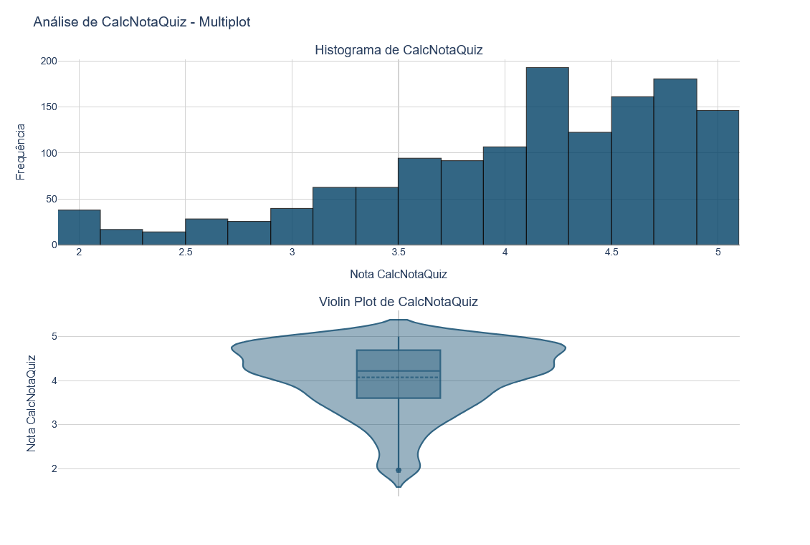<br>
  <sup>Fonte: Material produzido pelos autores (2025)</sup>
</div>

<div align="center">
  <sub>Figura x - Multiplot da variável Talleres (Oficinas)</sub><br>
  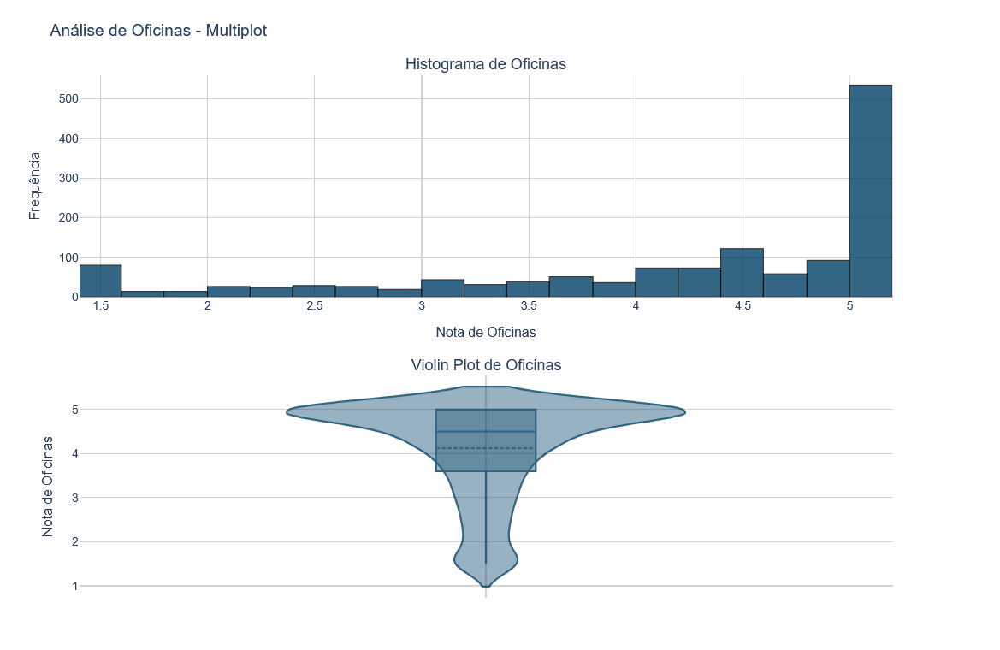<br>
  <sup>Fonte: Material produzido pelos autores (2025)</sup>
</div>

<div align="center">
  <sub>Figura x - Multiplot da variável Calificación_Oficial (Nota_Oficial)</sub><br>
  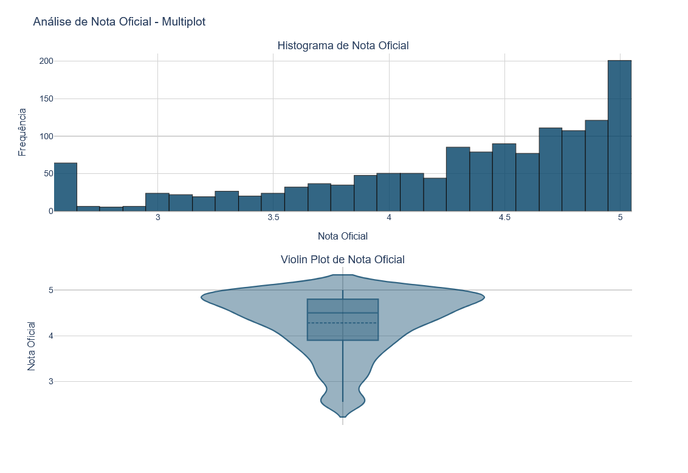<br>
  <sup>Fonte: Material produzido pelos autores (2025)</sup>
</div>

<div align="center">
  <sub>Figura x - Multiplot das três variáveis</sub><br>
  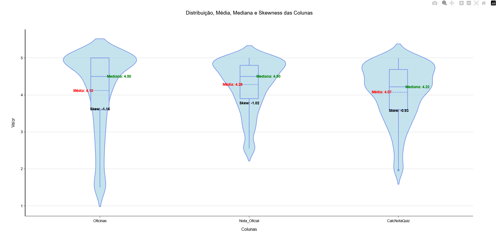<br>
  <sup>Fonte: Material produzido pelos autores (2025)</sup>
</div>

&ensp;A análise visual dos histogramas confirma os resultados dos testes estatísticos, revelando características específicas de cada distribuição. Nota-se que os gráficos das três variáveis possuem uma assimetria acentuada à esquerda, com os dados se concentrando em valores mais altos. Explicando a rejeição da normalidade e a diferença entre a média e a mediana quepode também ser visualizada no violin-plot.

A saber, a curva normal teórica usada como referência para os testes é dada por:

$$
f(x)=\frac{1}{\sigma\sqrt{2\pi}}\,e^{-\frac{(x-\mu)^2}{2\sigma^2}}
$$

&ensp;em que $\mu$ é a média e $\sigma$ o desvio padrão. A sobreposição dessa curva aos histogramas facilita a visualização dos desvios observados em todas as variáveis.

#### Comparação entre média e mediana

&ensp;No gráfico das três variáveis juntas, podemos ver que a média e a mediana de todas as três variáveis não coincidem, possuindo determinada distância. A variável Nota_Oficial e Oficinas têm a mediana (4,50) ligeiramente maior que a média (4,28 e 4,17, respectivamente), enquanto para CalcNotaQuiz a diferença é ainda menor. A proximidade entre esses dois valores dá uma forte indicação de que as distribuições não são simétricas.

&ensp;Essa observação visual é confirmada pelo cálculo do skewness. O skewness é uma medida numérica que quantifica a assimetria da distribuição. Um valor de zero indica simetria perfeita, enquanto para um valor negativo, a distribuição tem uma cauda mais longa para a esquerda, e em números positivos, a cauda é mais longa para a direita. De acordo com o cálculo, o skewness para Oficinas é -1,16, para Nota_Oficial é -1,02, e para CalcNotaQuiz é -0,93. Todos esses valores são negativos, o que valida a nossa observação visual de que as distribuições são assimétricas à esquerda.

### Escalonamento das variáveis selecionadas

&ensp;O escalonamento de variáveis quantitativas é uma etapa essencial no pré-processamento de dados para modelagem preditiva, sobretudo em algoritmos de machine learning sensíveis à magnitude das variáveis. O objetivo dessa técnica é padronizar as escalas, de modo a evitar que atributos com valores mais elevados exerçam influência desproporcional sobre o processo de aprendizado e prejudiquem o desempenho preditivo do modelo.

&ensp;No contexto da análise de dados da Universidad EAFIT, as três variáveis quantitativas selecionadas foram: CalcNotaQuiz, Talleres e Nota_Oficial. Essas variáveis podem fornecer informações muito importantes, uma vez que as Oficinas (Talleres), e os quizes são atividades que ocorrem com frequência e possuem grande influência na variável Nota_Oficial, que indica se um aluno foi reprovado ou não.

&ensp;O uso adequado do escalonamento possibilita que algoritmos de clustering, classificação e regressão processem os dados de maneira mais equilibrada, favorecendo a convergência dos modelos e aprimorando a precisão das predições. Além disso, contribui para a interpretação dos resultados e para a comparação consistente entre variáveis em análises exploratórias.

#### Métodos de escalonamento escolhidos para cada variável

&ensp;Para o escalonamento da variável "Calificación_Oficial", o método escolhido foi a padronização, pois é menos sensível a outliers significativos e mantém a escala das notas pré-escalonamento (de 0 a 5). Para a variável Talleres, o método escolhido foi a normalização (Min-Max) para manter a escala das notas de 0 a 1, e por fim, para a variável CalcNotaQuiz, o método de escalonamento escolhido foi a padronização, pois além de ser menos sensível a outliers, permite analisar a quantos desvios padrões de distância uma certa nota se encontra da média da amostra.

#### Equações de cada escalonamento

Primeiramente, segue a tabela dos valores a serem utilizados nas equações:

| Variável     | Mínimo    | Máximo      | Média    | Desvio Padrão |
|--------------|-----------|-------------|----------|---------------|
| CalcNotaQuiz         | 0.625000  | 5.000000    | 4.075710 | 0.772738      |
| Talleres             | 0.000000  | 5.000000    | 4.100491 | 1.281169      |
| Calificación_Oficial | 0.500000  | 5.000000    | 4.319476 | 0.768881      |

Seguindo com as equações:

**CalcNotaQuiz (Padronização)**

- Fórmula geral: $Z = (X - \mu) / \sigma$
- Fórmula específica: $Z = (X - 4.075710) / 0.772738$

**Talleres (Normalização)**

- Fórmula geral: $X' = \frac{X - X_{\min}}{X_{\max} - X_{\min}}$
- Fórmula específica: $X' = \frac{X - 0.000000}{5.000000 - 0.000000}$

**Calificación_Oficial (Padronização)**

- Fórmula geral: $Z = (X - \mu) / \sigma$
- Fórmula específica: $Z = (X - 4.319476) / 0.768881$

### Histogramas pós escalonamento

<div align="center">
  <sub>Figura x - Multiplot da variável CalcNotaQuiz pós escalonamento</sub><br>
  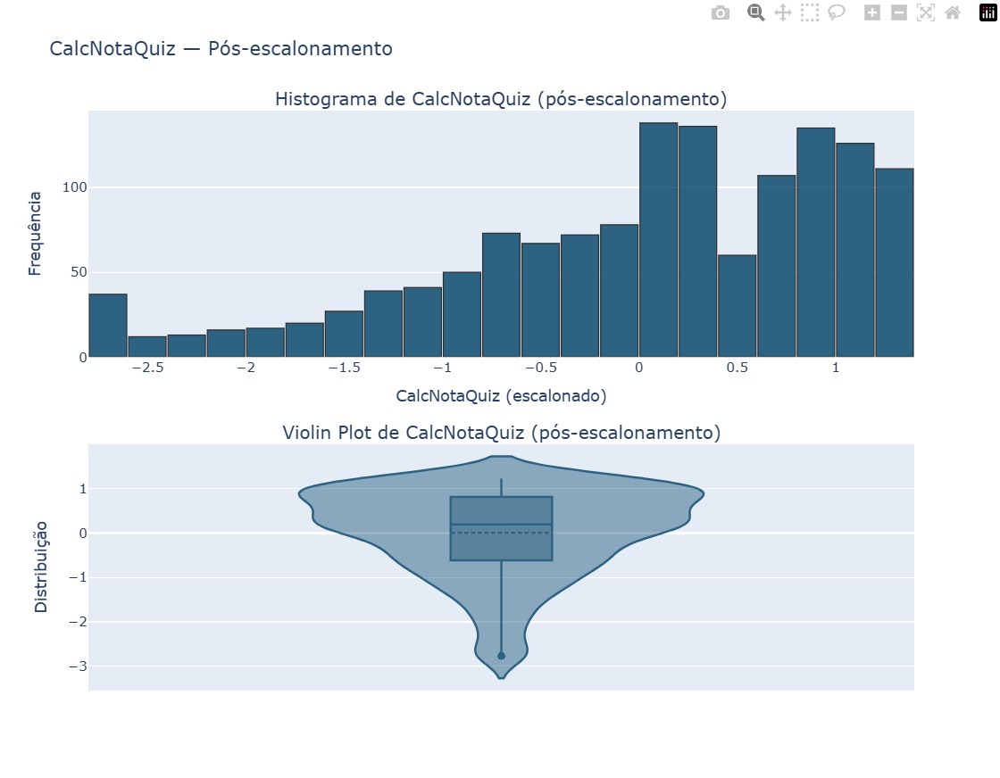<br>
  <sup>Fonte: Material produzido pelos autores (2025)</sup>
</div>

<div align="center">
  <sub>Figura x - Multiplot da variável Talleres (Oficinas) pós escalonamento</sub><br>
  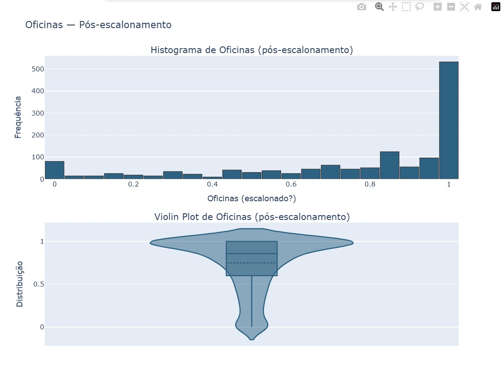<br>
  <sup>Fonte: Material produzido pelos autores (2025)</sup>
</div>

<div align="center">
  <sub>Figura x - Multiplot da variável Nota_Oficial pós escalonamento</sub><br>
  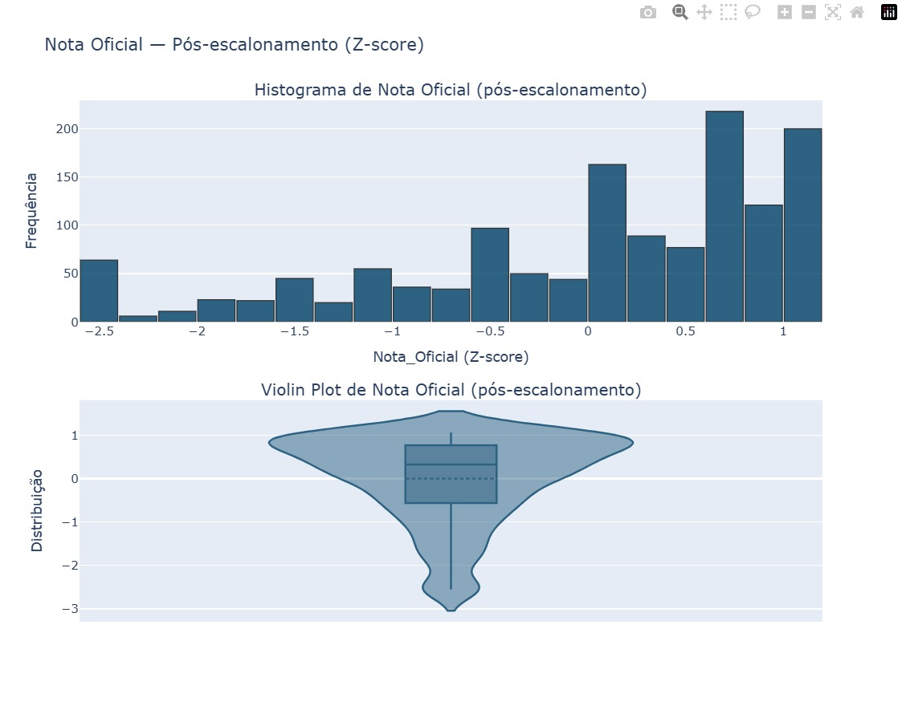<br>
  <sup>Fonte: Material produzido pelos autores (2025)</sup>
</div>

&ensp;Ao comparar com os histogramas pré escalonamento, nota-se que a principal mudança está na escala dos dados limitando-se ao limite superior igual a 1, contribuindo para a atribuição de pesos do modelo preditivo na etapa de treinamento e uma singela suavização dos gráficos.
